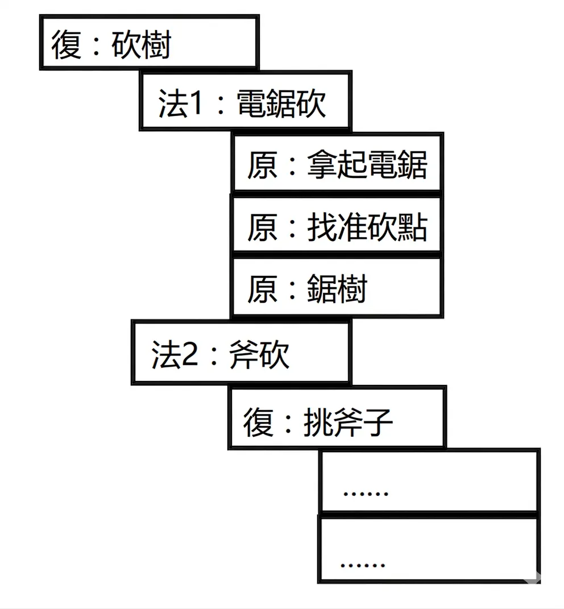

# GOAP 和 HTN 學習筆記

<head>
  <meta property="og:image" content="https://raw.githubusercontent.com/FlySkyPie/flyskypie.github.io/main/post/2026-05-08_goap-htn-learning/00_cover.png" />
</head>

## 前情提要

在完成了糞 Code 巡禮之後，我發現缺少一個有效的算法來探勘並解析 Git Repo，

:::info
關於糞 Code 巡禮請見前一篇文章：

[從 Zettelize 到糞坑：評點 deepwiki-open 程式碼](https://flyskypie.github.io/posts/2026-05-01_code-review/)
:::

於是我計畫從行之有年且可靠的傳統（經典）遊戲 AI 中尋找靈感，行為樹 (Behavior Tree) 是我的首選，但是在跟 LLM 討論的過程中它提到了 HTN (Hierarchical Task Network)，於是我認為有必要稍微了解它一下。

然後經過簡單的搜索之後，我隱約判斷正確的學習路徑應該是：

1. STRIPS (Stanford Research Institute Problem Solver)
2. GOAP (Goal Oriented Action Planning)
3. HTN (Hierarchical Task Network)

經過一番的學習之後，我大致理解了 STRIPS 的概念，並且寫了一篇文章紀錄：

[STRIPS 學習筆記](https://flyskypie.github.io/posts/2026-05-08_strips-learning-note/)

接下來我會假設讀者已經知道 STRIPS 或是閱讀過前一篇文章而不做過多的補充，缺乏先備知識可能會難以理解以下內容。

## GOAP (Goal Oriented Action Planning)

GOAP 基本上重用了 STRIPS 的問題模型，但是對 Action 加上了成本的概念，並且用 A* 演算法求解。

STRIPS 的問題本質上就是路徑規劃問題，所以用 A* 演算法求解似乎也沒什麼好意外的了。

[^goap]: 目標導向的AI系統（GOAP）技術分享 | 登峰造極者，殊途亦同歸。Retrieved 2026-05-08, from https://www.lfzxb.top/goal-oriented-action-planning-tech-share/

## HTN (Hierarchical Task Network)

HTN 同樣沿用了 STRIPS 中大部分概念，只是 Action 在這裡被分解了[^htn]：

- 原子任務（PrimitiveTask）
  - 基礎執行單元，不可再分解（如移動、攻擊）
  - 直接作用於世界狀態
- 方法（Method）
  - 由多個原子任務或復合任務組合而成。
  - 包含前提條件（condition）和一組子任務（Subtasks）；前提條件決定方法能否執行，子任務是具體的執行步驟
  - 按順序執行子任務（類似行為樹順序節點），任一子任務失敗則方法終止
- 復合任務（CompoundTask）
  - 由多個方法組成的邏輯容器
  - 執行時根據條件動態選擇其中一個方法（類似行為樹選擇節點）

GOAP 的運作邏輯是先設定一堆 Action，然後給定起點與目標求解路徑規劃。 HTN 則是先設定由一堆 PrimitiveTask、Method 和 CompoundTask 構成的巨大樹，運行時則是由當前狀態排除那些不符合條件的方法，最後留下一條可行的 PrimitiveTask 路徑（Task 序列）。

接著就會依照剛剛得出的 Task 序列開始運行，直到任務完成或是運行途中實際狀態跟剛剛模擬的情況不符合造成前提條件不滿足，那就回到剛剛那個完整的樹再重新規劃一次並再次運行[^htn-2]。

[^htn]: 【遊戲演算法】遊戲AI行為決策-分層任務網路（HTN）的簡單應用 | 白雪萬事屋. Retrieved 2026-05-08, from https://www.shirakoko.xyz/article/htn

[^htn-2]: 遊戲AI行為決策——HTN（分層任務網路） - 狐王駕虎 - 部落格園. Retrieved 2026-05-08, from https://www.cnblogs.com/OwlCat/p/17910900.html
