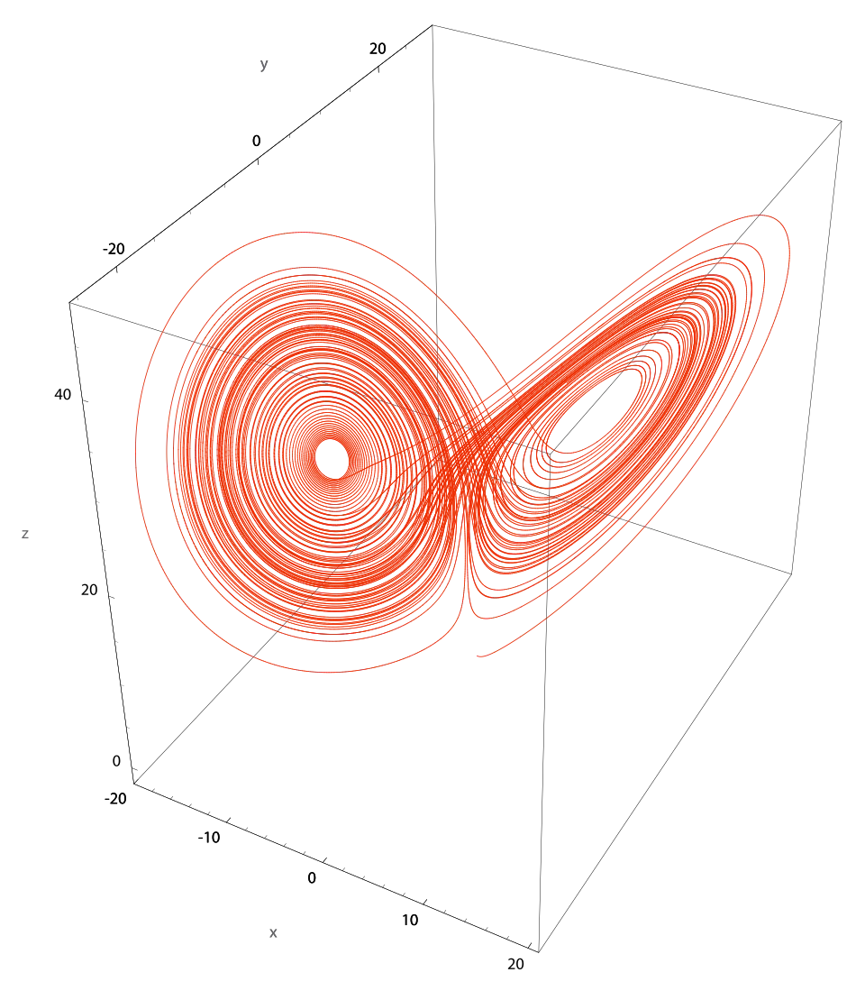
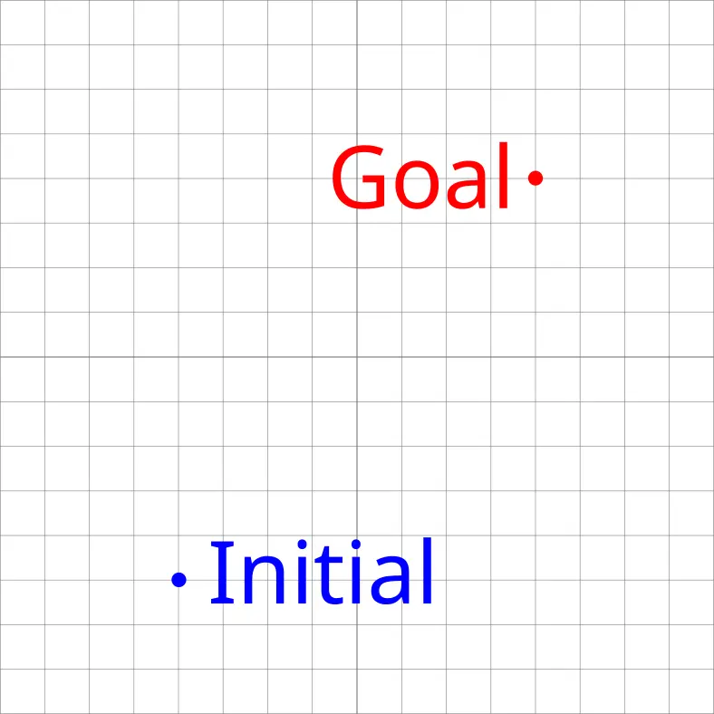
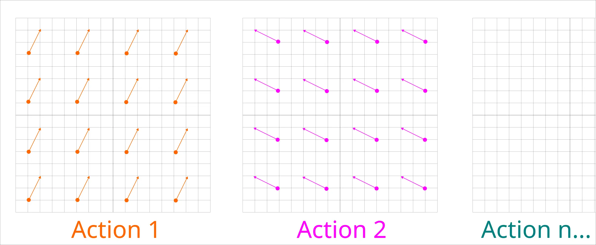

# STRIPS 學習筆記

<head>
  <meta property="og:image" content="https://raw.githubusercontent.com/FlySkyPie/flyskypie.github.io/main/post/2026-05-08_strips-learning-note/04_i-dont-know.webp" />
</head>

## 背景

最近在學習 STRIPS (Stanford Research Institute Problem Solver)，發現中文資料很少，而且也講的不是很好理解，於是我試著將我的理解寫一篇。

## 低維版本

首先我想用一般人比較熟悉的向量空間來解釋。

### 相空間

要理解我接下來的描述，讀者需要先備[相空間](https://zh.wikipedia.org/zh-tw/%E7%9B%B8%E7%A9%BA%E9%96%93)的概念。

如果你對「混沌理論」這個詞不陌生，你很有可能看過類似這樣的圖：

這其實就是一個相空間，每一個軸都是系統狀態的變數，因此一個點就描述了一個系統的狀態，而這些線條就是當給定一個初始狀態，這個動態系統會自然的往其他狀態移動。

第一次接觸這個概念的朋友可能會有點不好理解，因為一般人在建立向量的概念的時候通常是基於歐幾里得空間和牛頓力學之上：用向量來描述一個點的位置、速度和加速度。

「一個點會因為當下的狀態自己移動」這件事情想想有點不可思議，不過如果你這樣想：

- 這是一個一維空間，所以一個點的座標為 x。
- 放置另外一個質點，然後固定住它，因此剛剛放置的點會受到吸引力而獲得加速度 a。
- 因為獲得加速度，所以點的速度 v 是會變化的。
- v 變化了，x 就會變化；而 x 變化了，引力作用也會因此發生變化，那 a 就變化了。
- 所以你會得到一個 x, v 和 a 都不斷變化的系統。

接著你把 (x, v, a) 當成一個三維向量在空間中畫成一張圖，就會得到一個描述系統變化的三維曲線了。

### STRIPS 的模型

在 STRIPS 中，我們會定義目標和初始狀態，也就是相空間中的兩個點。

並且我會定義很多個 Action，每個 Action 有兩個特徵：

- 向量：讓狀態在相空間移動的一個向量。
- 條件：這個向量不是在相空間的每一個點都能使用（存在）。

用數學一點的描述方式，Action 就像是一個離散場 (Field)，只是每個狀態一次只能套用其中一個離散場移動到下一個狀態。

所以問題就變成：

> 已知無數離散場 (Action)；同時給定初始座標 (State Initial) 與目標座標 (State Goal)，求：什麼樣的 Action 排列可以從初始座標移動到目標座標？

STRIPS 本質上是在處理移動手段受限的路徑搜尋問題。

## 高維版本

剛剛我用二維的網格解釋，接下來這是高維的版本，只是每個維度的值是二元化的。

$$
S = (s_1, s_2, s_3, s_4, s_5, s_6, \dots, s_n)|_{s={0, 1}}
$$

初始狀態可能長這樣：

$$
S_{\text{init}} = (1, 0, 0, 0, 0, 0, \dots, 0)|_{s={0, 1}}
$$

目標狀態可能長這樣：

$$
S_{\text{goal}} = (1, 0, 0, 0, 0, 0, \dots, 0)|_{s={0, 1}}
$$

一個 Action 可能長這樣：

$$
\begin{aligned}
A_x &= (\text{Precondition}, \text{Update}) \\
  &= ((1, 0, 0, 0, 0, 0, \dots, 0)|_{s=\{0, 1\}}, \\
  &\quad (-1, 1, 0, 0, 0, 0, \dots, 0)|_{s=\{-1, 0, 1\}})
\end{aligned}
$$

所以問題就變成解：

$$
S_{\text{goal}} = S_{\text{init}}  + \sum Ax
$$

> 怎樣排列 Action，才能從初始狀態變成目標狀態？

## 比較接近原始描述的版本

因為現實中的可能狀態非常的多，因此在 STRIPS 中狀態不是一個向量，而是一個集合：

$$
S = \{s_1, s_2, s_3, s_4, s_5, s_6, \dots, s_n\}
$$

存在於集合的考慮為「真」，不存在的就考慮為「假」。換句話說，命題中出現過得狀態才要考慮，沒出現的就當作不存在，即便在數學的空間中它可能存在。

因此初始狀態可能長這樣：

$$
S_{\text{init}} = \{\text{"At(A)"}\}
$$

目標狀態則可能長這樣：

$$
S_{\text{goal}} = \{\text{"At(Z)"}\}
$$

一個 Action 可能長這樣：

$$
\begin{aligned}
A_x &= (\text{Preconditions}, \text{Effects}) \\
  &= (\{\text{"At(A)"}\}, \{-\text{"At(A)"}, + \text{"At(B)"}\})
\end{aligned}
$$

## 求解

STRIPS 建構了一個問題模型：

- State, Initial State, Goal State
- Action(Preconditions, Postconditions)
- 已知 Actions, Initial State, Goal State
- 求特定的 Actions 排列從 Initial State 到 Goal State

這個問題不一定有解，有解也不見得是唯一解。

好問題講完了，怎麼解？

STRIPS 本身只是建立一個問題模型，但是不包含解法。就像馬可夫鏈本身只是對問題進行數學建模，仍須透過 Q-learning 中的 value function 才能對問題求解。

至於針對 STRIPS 的具體解法我就不打算繼續深究了，因為學習 STRIPS 並不是我的目的，它只是據我了解三個算法中最簡單的那一個：

- STRIPS (Stanford Research Institute Problem Solver)
- GOAP (Goal Oriented Action Planning)
- Hierarchical Task Network

HTN 才是我這次學習的目標，只是前面兩個東西似乎在觀念上構築對理解 HTN 有幫助我才先開始看 STRIPS 並且順便寫一篇筆記的。
