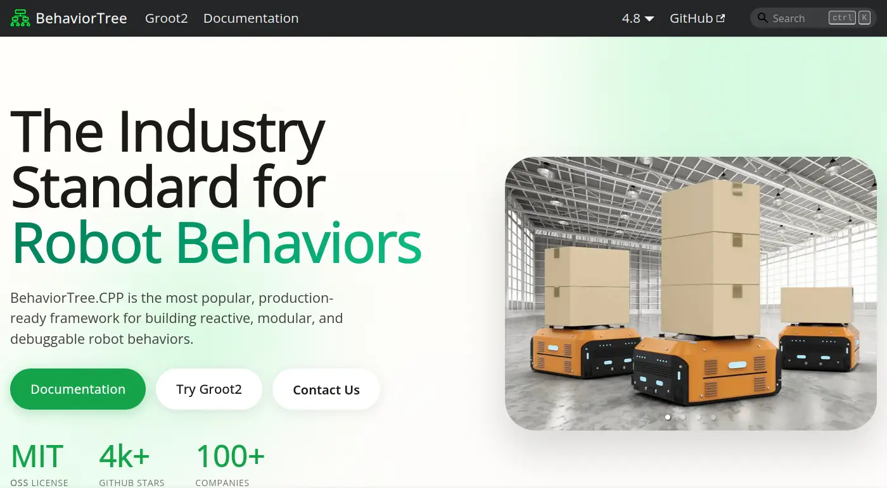
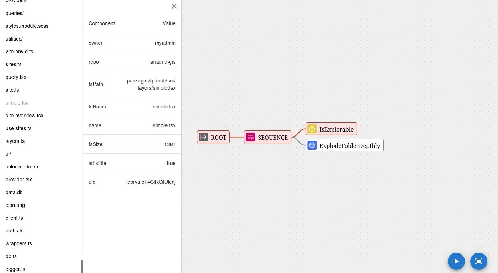

# TiddlyRAG Dev Log

## 前情提要

TiddlyRAG 的概念最早我在這篇文章就已經提出：

- [2025-10-06 一種人類友善 llms.txt 構想](https://flyskypie.github.io/blog/2025-10-06_a-idea-about-using-tiddlywiki-as-llmstxt/)

試著在本地運行嵌入模型：

- [2026-03-12 llama.cpp 本地嵌入伺服器初體驗](https://flyskypie.github.io/posts/2026-03-12_llama-cpp/)

調查幾個開源 LLM 應用程式在處理 RAG 相關的功能：

- [2026-03-14 不正經 LLM APP 調查：AnythingLLM](https://flyskypie.github.io/posts/2026-03-14_anything-llm-survey/)
- [2026-03-15 不正經 LLM APP 調查：Bionic](https://flyskypie.github.io/posts/2026-03-15_bionic-gpt/)
- [2026-03-15 不正經 LLM APP 調查：AstrBot](https://flyskypie.github.io/posts/2026-03-15_astr-bot-survey/)
- [2026-03-16 不正經 LLM APP 調查：Open WebUI](https://flyskypie.github.io/posts/2026-03-16_open-webui/)
- [2026-03-16 不正經 LLM APP 調查：LobeHub](https://flyskypie.github.io/posts/2026-03-16_lobehub/)
- [2026-03-16 不正經 LLM APP 調查：LibreChat](https://flyskypie.github.io/posts/2026-03-16_libre-chat/)
- [2026-03-16 不正經 LLM APP 調查：kotaemon](https://flyskypie.github.io/posts/2026-03-16_kotaemon/)

完成 POC Type-A，能夠匯入 TiddlyRAG 進行嵌入；並透過 MCP 進行檢索：

- [2026-04-28 POC Type-A](https://github.com/FlySkyPie/tiddlyrag-poc/tree/poc/type-a)

研究卡片化 (Zettelize) 的其中用例，將 Git Repo 轉換成文件，調查已經存在的實作，沒想到卻十分差勁：

- [2026-05-01 從 Zettelize 到糞坑：評點 deepwiki-open 程式碼](https://flyskypie.github.io/posts/2026-05-01_code-review/)

完成 POC Type-B，試著從 `deepwiki-open` 抽出部份邏輯重新實做：

- [2026-05-06 POC Type-B](https://github.com/FlySkyPie/tiddlyrag-poc/tree/poc/type-b)

接著回到本文的重點。

## 僵化的資料探勘策略

`deepwiki-open` 的實作方式是採取兩步驟：

1. 建立大綱（8~12頁）。
2. 根據大綱對每一頁生成內容。

並且輸入是從事先把所有文件嵌入的資料中檢索 20 個檔案出來，但是我實際實驗發現在特定情況會有問題。

以 `deepwiki-open` 自己的 Repo 為例，它包含了 10 個不同語言的 README，因此使用 README 進行向量檢索的時候，會得到一堆不同語言的 README 跟一些 i18n 的檔案，完全不能作為有效的參考資訊。

所以我完成 POC Type-B 到一個程度後沒打算繼續深入，因為這明顯是一條死路。

根本性的原因是僵化的資料探勘策略，Git Repo 的不確定性很高：

- 這是一個後端/後端/嵌入式系統/函式庫/UI 庫...專案？
- 這是一個程式專案？
- 這是一個文件專案？
- 這是一個 Monorepo？
- 這是很多 Microservice？
- ...

需要一種非固定流水線 (Pipeline) 的機制才有可能處理這種不確定性。

## 決策算法

我的直覺是透過行為樹 (Behavior Tree) 建立兼富彈性與可控性的資料探勘策略，不過在正式使用以前，我需要調查一下同樣在遊戲界常用的演算法，因此有了以下幾篇文章：

- [2026-05-08 STRIPS 學習筆記](https://flyskypie.github.io/posts/2026-05-08_strips-learning-note/)
- [2026-05-08 GOAP 和 HTN 學習筆記](https://flyskypie.github.io/posts/2026-05-08_goap-htn-learning/)

GOAP 和 HTN 建立在 STRIPS 模型之上，而 STRIPS 模型要求建模者必須對環境有一定程度的理解與掌控，用在遊戲環境沒問題（環境是遊戲開發者自己設定的），但是在 Git Repo 這種不確定性高的環境就顯得不合適。

Utility AI 是另外一個遊戲常用的古典 AI，它的行為比較簡單我就沒有特別深入研究寫文章了，基本上運作機制很接近感知機 (Perceptron) 配上可客製化的激勵函數，所以它的可預測性與可解釋性比 BT (Behavior Tree) 來得差。

所以最後還是選擇行為樹。

## 行為樹生態

下一步是了解行為樹的生態，一個完整的行為樹解決方案應該包含以下條件：

- Runtime SDK：用來運行 BT 的函式庫。
- 序列化與反序列化：BT 能夠以檔案形式存在，而不是硬編碼在程式內。
- 日誌：運行時紀錄下 BT 的狀態，用於事後除錯。
- 靜態視覺化：能夠以 GUI 瀏覽 BT 檔案。
- 動態視覺化：能夠以 GUI 遙測或模擬 BT。
- 視覺化編輯器：能夠以 GUI 編輯行為樹。

話雖如此，但是不考慮遊戲引擎生態的，因為它們的 BT 通常和遊戲引擎高度整合。因此條件變得更嚴苛了，要滿足上述條件還要有解偶與高內聚的特性。

[BehaviorTree.CPP](https://github.com/BehaviorTree/BehaviorTree.CPP) 是唯一一個我找到滿足上述條件的，另外一個發現是看來 BT 不只是用在遊戲產業，（實體）機器人產業似乎也有使用。

BehaviorTree.CPP 生態系內一款名為 [Groot](https://github.com/BehaviorTree/Groot) 的視覺化工具，包含了編輯、遙測與回放功能，乍看之下似乎很完美。就算我另外用 Javascript 做，只要照著 Spec 刻就能對接 BehaviorTree.CPP 的生態系直接使用 Groot。

然而隨著深入調查卻發現不盡人意的事實，Groot 1 不再維護，且僅支援到 BehaviorTree.CPP 3.X （最新版為 4.9），Groot 2 則採取閉源訂閱制付費的方案。

接著我一邊看著 Mistreevous 的行為與文件，並和 BehaviorTree.CPP 的文件比較，我發現我無法理解「正宗行為樹」的邏輯應該為何。BehaviorTree.CPP 的文件經常使用反應式 (Reactive)、非同步 (Async)、觸發 (Trigger)、中斷 (Interrupt)...等詞彙，但是根據描述我又無法跟我平時開發 Javascript 的經驗做連結。

於是我花了一、兩天整理了行為樹的一些先備知識：

https://flyskypie.github.io/microproject-wikis/behavior-tree.html

簡單來說：

> BT 最早是無狀態的，但是因為這樣每個 Cycle 都需要重新遍歷，這在大型或複雜的樹中會造成效能方面的問題。
> 
> 於是狀態被引入了，讓下一個 Cycle 可以根據情況從特定的節點開始檢查，減少重複運算。但是這造成另外一個問題，當環境發生變化時，行為樹無法適應這些變化，因為一些檢查被跳過去了。
> 
> 於是反應式 (Reactive)、非同步 (Async)、觸發 (Trigger)、中斷 (Interrupt) ...之類概念又被引入，用於抵銷狀態帶來的行為；可以在有狀態的 Scope 下條件性的觸發重新遍歷。
> 
> 這個歷史過程造成了一些概念上的混淆，然而大部分 BT 教學並沒有提及這個過程。

如果不把一些觀念釐清（Cycle vs Tick, 有狀態 vs 無狀態），跟 LLM 討論會陷入雞同鴨講的情況。

## Javascript 行為樹技術選型

調查了一下列一個清單：

- https://github.com/behavior3/behavior3js
  - 428 ⭐
  - https://github.com/behavior3/behavior3editor
    - 701 ⭐
  - https://github.com/renatopp/behavior3js
    - 145 ⭐
  - https://github.com/renatopp/behavior3js/wiki/JSON
  - https://github.com/mybios/behavior3-typescript
    - Typescript Fork
- https://github.com/Calamari/BehaviorTree.js
  - 339 ⭐
  - https://github.com/Calamari/BehaviorTree.js-Examples
- https://github.com/yantra-core/Sutra.js
  - 188 ⭐
  - 作者大概非常不喜歡 Typescript[^Sutra-js]
- https://github.com/nikkorn/mistreevous
  - 132 ⭐
  - 作者大概很喜歡 Typescript
  - https://github.com/nikkorn/mistreevous-visualiser

behavior3js 乍看是聲望最高、又有視覺化工具，但是它自 2018 年以來就沒有更新了，而且文件十分凌亂，分散在程式碼內、GitHub Wiki、死掉的網站連結...內，所以我沒辦法快速的搞清楚這東西要怎麼使用。

BehaviorTree.js 則是 2021 年以來沒有更新，2026 年有推出支援 Typescript 的 beta 版本，不過缺乏生態系其他配套（特別是視覺化）。

Sutra.js 就算撇除作者在 Reddit 跟別人筆戰「Javascript 不需要型別」以外，README 映入眼簾的是 `if/else` 語法以及事件驅動等功能，完全背離 BT 的設計哲學。並且同樣缺乏 BT 視覺化配套。

Mistreevous 的聲望（星星數）並不是最高的，但是從文件的易用性、原生 Typescript 支援、視覺化的支援、序列化與反序列化的重視程度...綜合考量下是一個優秀的選擇。

具體差異我就不在這邊解釋，情況有一點複雜。

[^Sutra-js]: Sutra.js - Fluent Behavior Trees for JavaScript Game Development : r/javascript. https://www.reddit.com/r/javascript/comments/194e8ef/

## 資料組織方案

這邊我要先補充一個關於 BT 的先備知識，BT 原則上是無狀態的，典型的 BT 會使用「黑板模式」：所有狀態是儲存在一個叫做黑板 (blackboard) 的東西裡面，簡單來說就是一個 key-value 表，然而實務上容易變成「一堆放在一起的全域變數」。

這對我而言是無法接受的，而碰巧我有使用 ECS (Entity-Component-System) 的經驗：

[ECS 學習與 aimAndShoot 重構之旅](https://flyskypie.github.io/blog/2023-09-24_a-journey-about-learning-ecs/)

於是這件事就這樣自然發生了：

簡單來說 ECS 和 BT 都遵守 DoP (Data-oriented programming) 的哲學，因此資料跟邏輯本來就解偶了，所以把 ECS 中處理的資料的 EC 嫁接到 BT 上非常容易。

## POC

結論，我完成了一個能夠在「深度優先遍歷」與「廣度優先遍歷」切換的 BT：

https://github.com/FlySkyPie/tiddlyrag-poc/tree/poc/type-c

「僵化的資料探勘策略」的問題並未完全解決，但是 POC 的策略就是一次只驗證一件事情，我認為完成一個具有彈性的 BT 框架就算完成階段性任務了。

## 下一步？

以下節錄自我的腦力激盪過程：

> 原始的設計期望透過「逐步探索」的方式來降低無用的資訊，並假設可以無須遍歷所有檔案，但是這個構想當中存在著謬誤。
> 
> LOD (Level of Development) 是在多媒體中經常被使用的技巧，白話來說就是越不重要的東西做得越粗糙，其中一個經典的應用就是遊戲場景，遠景時使用低面數、粗糙的模型，當攝影機拉近時再切換成高面數、精緻的模型。
> 
> 但是即便如此，LOD 能夠運作的前提是先有一個高面數的理想模型，再對其進行降低面數的處理，因此低模存在的前提是該模型的細緻特徵已知。
> 
> 再回過頭看原始「逐步探索」的設計就顯得不合理，因為資訊聚合 (Aggregation) 的前提是要先具備完整資訊。

最後我將這個問題定位為：探索與利用問題 (Exploration and Exploitation)。

我已經稍微回顧了：

- 多臂老虎機問題 (multi-armed bandit problem, MAB)
- ϵ-greedy
- UCB (Upper Confidence Bound)
- Thompson Sampling

下一步的重點可能會放在「如何用蒙地卡羅樹搜尋 (MCTS, Monte Carlo tree search) 解決這個資料探勘問題」上。

## 題外話

因為 TiddlyRAG 這個 Side Project 我也跑好一陣子了，最近想該給它一個正式的 LOGO 了，於是這張圖就產生了：

