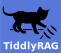
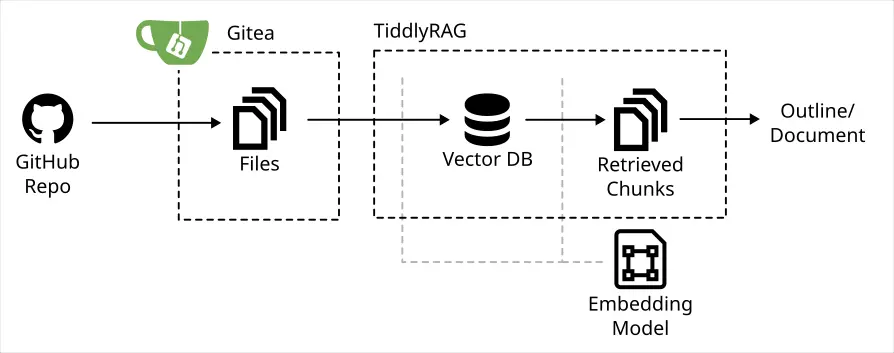
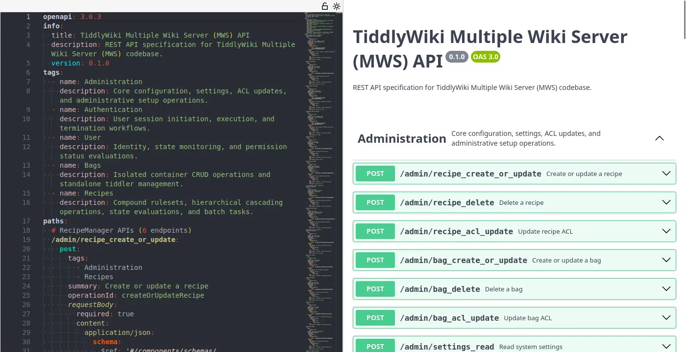
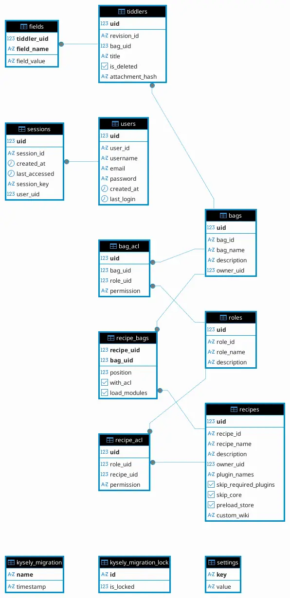

# TiddlyRAG Dev Log - MWS API

<head>
  <meta property="og:image" content="https://raw.githubusercontent.com/FlySkyPie/flyskypie.github.io/main/post/2026-05-30_tiddlyrag-dev-log/05_mws-api-spec.webp" />
</head>



## 前情提要

[POC Type-A](https://github.com/FlySkyPie/tiddlyrag-poc/tree/poc/type-a) 探索了向量資料庫、嵌入模型並對外暴露 MCP (Model Context Protocol)：


[POC Type-B](https://github.com/FlySkyPie/tiddlyrag-poc/tree/poc/type-b) 探索了 `AsyncFuncAI/deepwiki-open` 專案處理「如何把 Git Repo 轉換成文件？」這個問題的方式，並做出了一些改良，其中一個重點改良是將 Git Repo 微服務化，TiddlyRAG 不直接與檔案系統中的 Git Repo 互動，而是透過 Gitea 提供的 API：



如此一來 Git Repo 相關的業務邏輯就變成了 TiddlyRAG 不關注的通用域問題。舉例來說，TiddlyRAG 不再需要考慮 `git clone` 失敗與否產生的各種 edge case，只需要呼叫 Gitea 中 `migrate` 的 API 即可。

透過 HTTP API 操作，更容易實現權限控制與訪問審計等需求，這在基於 LLM 建構的智能體 (Agent) 系統帶來的不可空性中顯得更為重要。

[POC Type-C](https://github.com/FlySkyPie/tiddlyrag-poc/tree/poc/type-c) 探索了 ECS (Entity-Component-System) 與行為樹 (Behavior Tree) 建構的智能體框架：


並實做了簡單的深度優先遍歷與廣度優先遍歷作為概念驗證。

## TiddlyWiki 微服務

在 POC Type-A 中，TiddlyWiki 是以相對隨便定義的方式儲存在 TiddlyRAG 內的資料庫中，但是就像 POC Type-B 處理的問題一樣，「TiddlyWiki」的儲存並不是 TiddlyRAG 關注的問題，因此在 TiddlyRAG 的微服務架構中，應該要有一個專門用儲存 TiddlyWiki 的實例。

以下是我經過調查，跟這個主題有關的專案：

- https://github.com/Arlen22/TiddlyServer
  - 265 ⭐
- https://github.com/tiddlyhost/tiddlyhost-com
  - 222 ⭐
- https://github.com/tiddlyweb/tiddlyweb
  - 104 ⭐
- https://github.com/TiddlyWiki/MultiWikiServer
  - 54 ⭐

`TiddlyServer` 的作者同時也是 `MultiWikiServer` 的主要貢獻者，並且在 README 明確的表明該專案已經中止，後續的開發能量會轉移給 `MultiWikiServer`。

`tiddlyhost-com` 雖然有「多租戶」的概念，但是它的主要運作方式是以 static asset 的方式 serve 多個 TiddlyWiki 檔案，因此就算它有 API，原子操作也是 TddilyWiki （整個網頁）而不是 Tiddler （條目）。

`tiddlyweb` 是完全以 Python 實做的伺服器，然而大部分實作依然停留在 Python 2.7 時期，甚至連 Python 3.3 的遷移也尚未完成就已經中止開發。

並且它是基於 TiddlyWiki 2.0 設計的，現代的 TiddlyWiki (TW5) 要使用這個專案必須做一些調整[^tiddlyweb-tw5]。

`MultiWikiServer` 似乎是 TiddlyWiki 生態系中以官方的角色建構的「TiddlyWiki 微服務後端方案」，然而它依然存在一些問題。

[^tiddlyweb-tw5]: TiddlyWiki in the Sky (or TiddlyWeb for TW5) - Pleasant Programmer. Retrieved 2026-05-30, from https://pleasantprogrammer.com/posts/tiddlywiki-in-the-sky-or-tiddlyweb-for-tw5.html

## MWS 的問題

接下來解釋一下 MWS (MultiWikiServer) 有哪些問題，如果依照 README 上的指南試著建立環境：

- `npm init @tiddlywiki/mws@latest my-folder`
- `cd my-folder`
- `npx mws init-store`
- `npx mws listen --listener`

會遇到很多光怪陸離的事情。

### 其他套件管理工具不友善

因為在 `@tiddlywiki/create-mws` 寫死 `npm`，所以就用：

```shell
pnpm create @tiddlywiki/mws@latest my-folder
```

得到的 `node_modules` 會報錯。

### hard code 仰賴

試圖安裝並執行 `mws` 指令時也會報錯，因為：

```json
{
  "dependencies": {
    "prisma-client": "file:prisma/client",
  }
}
```

`package.json` 的仰賴是寫死的。

### Docker 安裝

如果依照 README 的 docker 安裝步驟：

```shell
# Create your data directory
mkdir my-mws-data
cd my-mws-data

# Download the required files
curl -O https://raw.githubusercontent.com/TiddlyWiki/MultiWikiServer/main/docker-compose.directory.yml
curl -O https://raw.githubusercontent.com/TiddlyWiki/MultiWikiServer/main/Dockerfile

# Create store directory
mkdir -p store

# Start MWS
docker-compose -f docker-compose.directory.yml up -d

# Initialize the database (required on first run)
docker-compose -f docker-compose.directory.yml exec mws npx mws init-store

# Access at http://localhost:8080
# Default credentials: admin / 1234
```

則會得到一個非常簡易的 React.js 前端頁面。

### 設計哲學與程式風格

MWS 的設計依然部份延續 TiddlyWiki 的路徑，也就是軟體邊界模糊（前後端不分），以及為了保持自舉的特性，很多功能不使用函式庫而是自己重複造輪子。

舉例來說，透過 Docker 運行起來後，我的瀏覽器插件顯示它的前端使用 React，於是我便調查一下的程式碼，確實有前後端分離的跡象，但是依然出現疑似 JSX 輪子的東西：

<details>
<summary>`packages/jsx-runtime/jsx-render.ts`</summary>

```typescript
import { MaybeArray } from "./jsx-utils";

export const JSXElementSymbol: unique symbol = Symbol("__is_jsx_element__");

const HTML_NAMESPACE = "http://www.w3.org/1999/xhtml";
const MATH_NAMESPACE = "http://www.w3.org/1998/Math/MathML";
const SVG_NAMESPACE = "http://www.w3.org/2000/svg";

const OldPropsSymbol: unique symbol = Symbol("__old_props__");
const KeyChildren: unique symbol = Symbol("__key_children__");
const OwnKeySymbol: unique symbol = Symbol("__own_key__");
const DOMElementSymbol: unique symbol = Symbol("__dom_element__");

const observer = new MutationObserver((mutations) => {
  for (const mutation of mutations) {
    const callbacks = observerCallbacks.get(mutation.target as Element);
    if (callbacks) for (const cb of callbacks) cb();
  }
});

const observerCallbacks = new WeakMap<Element, (() => void)[]>();

export function render(root: Element | DocumentFragment, child: MaybeArray<JSX.Node>) {
  updateChildren(root, [child].flat(Infinity) as JSX.Node[]);
}
```
</details>

另一方面則是不使用 Express.js 之類主流的後端路由框架，而是自己創造另外一種模式：

<details>
<summary>`packages/mws/src/managers/wiki-external.ts`</summary>

```typescript
  handleLoadBagTiddler = zodRoute({
    method: ["GET", "HEAD"],
    path: BAG_PREFIX + "/:bag_name/tiddlers/:title",
    bodyFormat: "ignore",
    zodPathParams: z => ({
      bag_name: z.prismaField("Bags", "bag_name", "string"),
      title: z.prismaField("Tiddlers", "title", "string"),
    }),
    inner: async (state) => {
      const { bag_name, title } = state.pathParams;
      const bag = await state.assertBagAccess(bag_name, false);
      throw await state.$transaction(async (prisma) => {
        const server = new WikiStateStore(state, prisma);
        return await server.serveBagTiddler(bag.bag_id, bag_name, title);
      });
    }
  });
```
</details>

或是手刻 HTTP body 解析：

<details>
<summary>`packages/mws/src/managers/wiki-utils.ts`</summary>

```typescript
export async function recieveTiddlerMultipartUpload(state: ZodState<"POST", "stream", any, any, zod.ZodTypeAny>) {

  // Process the incoming data
  const inboxName = new Date().toISOString().replace(/:/g, "-");
  const inboxPath = resolve(state.config.storePath, "inbox", inboxName);
  mkdirSync(inboxPath, { recursive: true });

  const parts: MultipartPart[] = [];

  interface UploadPart2 {
    inboxFilename?: string;
    value?: string;
    hasher?: Hash;
    length: number;
    fileStream?: Writable;
    hash?: string;
  }

  const incomingParts = new WeakMap<MultipartPart, UploadPart2>();
  const inboxFiles = new WeakMap<MultipartPart, string>();
  const valueParts = new WeakMap<MultipartPart, string>();

  await state.readMultipartData({
    cbPartStart: async function (part) {
      const part2: UploadPart2 = {
        hasher: createHash("sha-256"),
        length: 0,
      };

      if (part.filename) {
        const inboxFilename = (parts.length).toString();
        const inboxFilename2 = resolve(inboxPath, inboxFilename);
        part2.fileStream = createWriteStream(inboxFilename2);
        inboxFiles.set(part, inboxFilename2);
      } else {
        part2.value = "";
      }

    },
    cbPartChunk: async function (part, chunk) {
      const part2 = incomingParts.get(part)!;
      if (part2.fileStream) {
        await new Promise<void>((res) => {
          part2.fileStream!.write(chunk) ? res() : part2.fileStream!.once("drain", () => res());
        });
      } else {
        const encoding = part.headers.get("content-type")?.charset || "utf8";
        if (!Buffer.isEncoding(encoding)) {
          throw new SendError("MULTIPART_INVALID_PART_ENCODING", 400, {
            partIndex: parts.length,
            partEncoding: encoding,
          });
        }
        part2.value! += chunk.toString(encoding as BufferEncoding);
      }
      part2.length += chunk.length;
      part2.hasher!.update(chunk);
    },
    cbPartEnd: async function (part) {
      const part2 = incomingParts.get(part)!;

      if (part2.fileStream) part2.fileStream.end();
      else valueParts.set(part, part2.value ?? "");

      part2.hash = part2.hasher!.digest("base64url");
      part2.fileStream = undefined;
      part2.hasher = undefined;
      incomingParts.delete(part);
      parts.push(part);
    },
  });

  const partFile = parts.find(part => part.name === "file-to-upload" && !!part.filename);

  if (!partFile) throw state.sendSimple(400, "Missing file to upload");

  const missingfilename = "File uploaded " + new Date().toISOString();

  const type = partFile.headers.get("content-type")?.mediaType;
  const tiddlerFields: TiddlerFields = { title: partFile.filename ?? missingfilename, type, };

  for (const part of parts) {
    const tiddlerFieldPrefix = "tiddler-field-";
    if (part.name?.startsWith(tiddlerFieldPrefix)) {
      const name = part.name.slice(tiddlerFieldPrefix.length);
      const value = valueParts.get(part)?.trim() ?? "";
      (tiddlerFields as any)[name] = value;
    }
  }

  const contentTypeInfo = state.config.getContentType(type);

  const file = await readFile(inboxFiles.get(partFile)!);

  tiddlerFields.text = file.toString(contentTypeInfo.encoding as BufferEncoding);

  rmSync(inboxPath, { recursive: true, force: true });

  return tiddlerFields;
}
```
</details>

### 結論與策略

MWS 依然處於非常早期的開發狀態，並沒有穩定到足夠被當作微服務使用，另外它已經實作一些 ACL (Access Control List) 相關的邏輯，如果在缺乏配套的情況下在 POC 中當作微服務使用會構成阻礙。例如：缺乏聲明式配置，必須手動初始化使用者，或是想要進行簡單的 CRUD 卻被 ACL 的 bug 阻擋。

然而就算撇開「開發早期」這個條件不談，差勁的程式碼職責分離除了會造成專案的成長受限以外（實作偏離範式，其他開發者看不懂、無法理解就無法貢獻），這種程式碼很容易產生漏洞，產生漏洞就不能有可靠的安全性保證，造成其身份驗證的功能虛有其表、形同虛設，不只無法提供安全性，反而拖累開發能量。經過調查之後我還發現它的 ACM (Access Control Model) 有根本性的缺陷，這個等等再補充。

因此我打算採取的策略是，根據原始實作抽出 HTTP API 界面，並使用它的資料庫設計當作參考，直接用 NestJS 重新實做，建立一個「MWS API 兼容伺服器」。

一來是出於對官方原始設計的尊重，並且透過兼容的方式避免跟 TiddyWiki 原始的生態系走太遠。二來是當我的實作走得比較前面時，發現的問題或解決方案可以反過來向 TiddlyWiki 的官方回報或貢獻。

## 目前進展

經過三天的研究，已經成功抽出 API 定義並且用 OpenAPI YAML 紀錄：



LLM (Large Language Model) 非常擅長幹這種事情，不過隨著進展到特定 API 的細節時往往還是會發現錯誤（幻覺），所以需要在原始實作跟生成的文件中來回閱讀。

昨天進展到這幾個 API 的實做時：

- `POST /bag/{bag_name}/tiddlers`
- `POST /admin/bag_create_or_update`

才開始研究 API 行為跟資料庫之間的互動具體是怎麼進行的。



我們可以看到 Tiddler （條目）實際上是被掛在 Bag （知識包）之下，並且有一個名為 Recipe 的抽象會決定一個 TiddlyWiki 最後要長怎樣。同時 MWS 存在這樣的 API：


這是一個類似 OverlayFS 的設計，`POST "/recipe/:recipe_name/tiddlers"`，實際上是去找到最上層的 Bag 進行寫入。這個模型設計似乎是延續自 TiddlyWeb。

然而我看到這裡我就瞬間感覺使用 ACL 是一個錯誤的技術決策。Recipe 和 Bag 是多對多關係，同時 Tiddler 的操作界面是 Recipe 的視角看過去，這種關聯性授權 (Authorization) 控制應該由 ReBAC (Relationship-based access control) 處理。

況且我的目的是建立一個支援多租戶邏輯的 TiddlyWiki 的儲存實例，AuthN/AuthZ (Authentication/Authorization) 不是我首要關注的問題。
