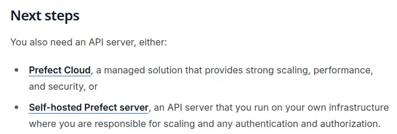
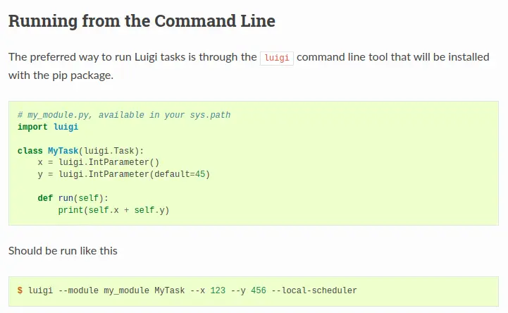
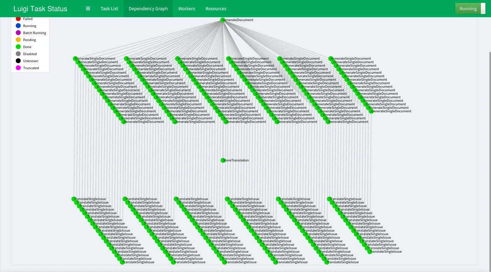
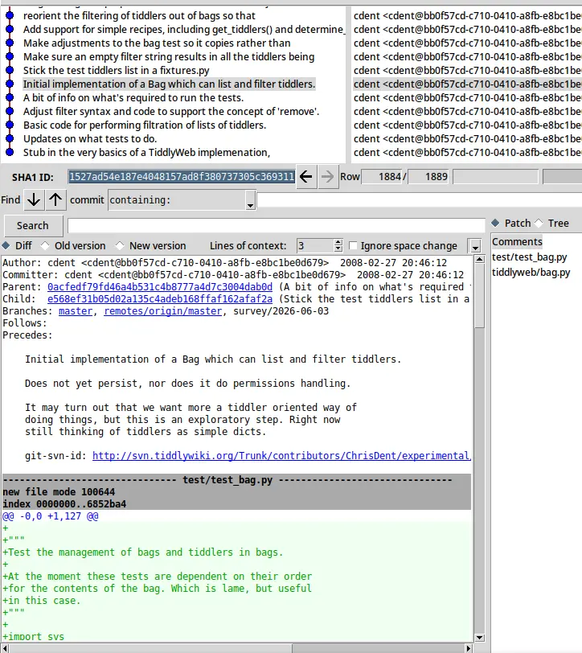

# TiddlyRAG Dev Log - MWS 與 ETL

<head>
  <meta property="og:image" content="https://raw.githubusercontent.com/FlySkyPie/flyskypie.github.io/main/post/2026-06-03_tiddlyrag-dev-log/03_etl.webp" />
</head>

## 前情提要

[TiddlyRAG Dev Log - MWS API | 工程屍 FlyPie 的異想世界](https://flyskypie.github.io/posts/2026-05-30_tiddlyrag-dev-log)

在前一篇文章中，我提到了 MWS (MultiWikiServer) 時做了一個名為 Recipe-Bag 多對多模型，用來展現類似於 OverlayFS 的行為。

但是我依然不能百分之百確定這個模型的設計哲學以及正確的行為是什麼，舉例來說：

- 對 Recipe 名下的某個 Tiddler 寫入時，是永遠寫到 Bag 的最上層嗎？這是不是代表每個 Recipe 都至少包含一個 Bag 作為 Overlay？
- Recipe-Bag 模型是從哪裡來的？是如我直覺的啟發自 OverlayFS 還是其實長得很像但是細節不太一樣？

## 翻譯 ETL

於是我計畫建構一個 ETL (Extract, Transform, and Load) 來處理這個問題：透過 GitHub API 拉出 Issue 和 Comment （討論紀錄）、進行翻譯、最後輸出成方便我閱讀的 Markdown。

除了表面的目的以外還有其他考量：最近我在 104 看職缺的時候，發現一些關於 ETL 的職位會提到 Perfect 這類工具，於是我想這是一個嘗試新東西的機會。

雖然我也可以嘗試透過最近完成的 EC-BT (Entity Component Behavior Tree) 進行資料探勘，但是我依然需要對標準的 ETL Pipeline 有基本的認識才能避免重複發明輪子。

一開始我是試著搭建 Prefect 的環境，不過過程中我看到了這個：



這讓我的開源雷達亮紅燈。加上它的文件不是很清楚，我沒辦法一下子搞清楚誰是 Client？誰是 Server？誰是 Workder？

另外一點，這是 Luigi 的官方範例[^luigi-example]：

```python
class AggregateArtists(luigi.Task):
    date_interval = luigi.DateIntervalParameter()

    def output(self):
        return luigi.LocalTarget("data/artist_streams_%s.tsv" % self.date_interval)

    def requires(self):
        return [Streams(date) for date in self.date_interval]

    def run(self):
        artist_count = defaultdict(int)

        for input in self.input():
            with input.open('r') as in_file:
                for line in in_file:
                    timestamp, artist, track = line.strip().split()
                    artist_count[artist] += 1

        with self.output().open('w') as out_file:
            for artist, count in artist_count.iteritems():
                print(artist, count, file=out_file)
```

它顯式的表明了一個 Task 的輸入與輸出，比較符合我對 ETL 的想像，畢竟是 ETL (Extract, Transform, and Load) 對吧？

反之 Prefect 的官方範例則是長這樣：

```python
from prefect import flow, task
import httpx


@task(log_prints=True)
def get_stars(repo: str):
    url = f"https://api.github.com/repos/{repo}"
    count = httpx.get(url).json()["stargazers_count"]
    print(f"{repo} has {count} stars!")


@flow(name="GitHub Stars")
def github_stars(repos: list[str]):
    for repo in repos:
        get_stars(repo)


# run the flow!
if __name__ == "__main__":
    github_stars(["PrefectHQ/prefect"])
```

好，你定義了一個像是 Pipeline 的東西，但是你的 Load 勒？

另外，最近學習 NestJS 和 FastAPI 的經驗讓我對於 Prefect 的語法有一點防禦心理。FastAPI 高度仰賴 Dep 注入函式的方式建構，副作用就是專案的組織充滿可能性，造成程式碼很雜亂，反而是 NestJS 基於物件的結構直接隱式的決定了程式碼的位置以及如何在專案中組織。

> 看起來好像有點用... 但老實說，我覺得用一個簡單的 Makefile 就能搞定所有這些東西了。用這種工具的好處是什麼啊？
>
> 路易吉的確是受到 GNU make 的啟發（文章裡不同地方有提到），而且文章裡的微型範例並沒有展現它所有的功能。它跟 Spark 和 Hadoop 這樣的框架配合得很好，它支援開箱即用的不同資料儲存目標，你有錯誤報告、依賴關係圖視覺化等等。 [^luigi-reddit]

這個算是我嘗試 Luigi 的原因之一，CMake 或 Bazel 這類本地建置工具長什麼樣子我心裡有底，所以我需要的是一個光譜在 CI/CD 或本地自動化工具以外的 ETL/Data Orchestration 工具來了解領域模型。

貼文有 11 年老，但是 Luigi 看起來還有在維護，UI 以現代眼光來看也不會太差。初試 Prefect 無果之後我便嘗試 Luigi，



然後沒遇到什麼問題就接著實作，最後把我的需求解決掉了。

[^luigi-reddit]: 用 Luigi 在 Python 裡建資料管道 : r/Python. https://www.reddit.com/r/Python/comments/3rjkry/comment/cwppm86/?tl=zh-hant&utm_source=share&utm_medium=web3x&utm_name=web3xcss&utm_term=1&utm_content=share_button

[^luigi-example]: Example – Top Artists — Luigi 3.8.1 documentation. https://luigi.readthedocs.io/en/stable/example_top_artists.html

## Luigi

先講結論，程式碼在此：

https://github.com/FlySkyPie/github-issue-simple-etl

它在 Luigi 的框架下運行了 ETL：

- 從 GitHub 下載 Issue
- 利用 LLM (OpenAI-Compatible API) 翻譯
- 將翻譯結果做成適合閱讀的 Markdown
- 適度的暫存與事務 (Transaction) 操作

---

我用過 Jenkins 之類的 CI/CD，也用過 CMake 之類的本地自動化，這個所謂的 ETL 工具憑什麼自立一個名為 Data Orchestration 的領域？

> 我沒有完整的答案，但從快速瀏覽 的氣流教學 來看，最明顯的是它是一個自上而下的 DAG 規格，並手動建立節點之間的連接。
>
> 相比之下，Luigi 元素之間的連接是隱式的，而且是自下而上的。 [^top-down]
>

注意，這裡的上下不是組件的基礎與抽象的上下，而是資料上游下游的上下。CI/CD 這種需要某種東西觸發 (Git Branch 更新)的 Pipeline 就是由上而下，而由下而上更長出現在本地自動化，比如 Makefile：

```makefile
main: main.o sub.o
    gcc main.o sub.o -o main
main.o: main.cpp
    gcc main.cpp -c
sub.o: sub.cpp
    gcc sub.cpp -c
clean:
    rm -rf main.o sub.o
```

我想要 `main` 的時候，會觸發它的仰賴 `main.o`  和 `sub.o` 於是自動化工具一路找到最上游還沒進行的任務把事情做掉。這一事實會讓工具變成冪等性的，而這也是 Luigi 具備但是不屬於 CI/CD 核心的特性（某些 CI/CD 會透過 Artifact 優化 Pipeline，但是不是特別重視這個特性，它們比較在意產出 latest）。

令一方面 ETL 比起本地自動化更注重分散負載，即 CI/CD 常用的 Server-Worker 架構，ETL 則是缺乏「佈署」或「觸發」的概念，因此多了一個直接操作 Pipeline 的 Client。

不過我認為 ETL 最重要的特性之一是「動態 Pipeline」，不論是 CI/CD 還是本地自動化，參數通常是一開透過設定檔、平台變數或是環境變數決定的，然後 Pipeline 的「形狀」通常是固定的，然而以我的實作為例：



實際上我只定義了五種 Task：

- DownloadIssues
- GenerateDocument
- GenerateSingleDocument
- StoreTranslation
- TranslateSingleIssue

運作後的 Pipeline 中的很多實際任務節點是根據 GitHub repo 下的 Issue 數量與號碼指定的，對於一個翻譯任務節點而言，它的設定如下：

```python
class TranslateSingleIssue(Task):
    target_repo: Parameter = Parameter(
        description="The issues of GitHub Repo going to translate",
    )

    api_base: Parameter = Parameter(
        description="API base url of OpenAI-Compatible API",
    )

    model_name: Parameter = Parameter(
        description="model name of LLM",
    )

    language_name: Parameter = Parameter(
        description="Target language of translation",
    )

    issue_number: IntParameter = IntParameter()
```

`api_base`、`model_name` 和 `language_name` 是可以在 `.cfg` 檔案設定的，但是 `target_repo` 和 `issue_number` 是它的**下游**指定的：

```python
class GenerateSingleDocument(Task):
    def requires(self):
        return [
            TranslateSingleIssue(
                target_repo=self.target_repo,  # type: ignore
                issue_number=self.issue_number,
            )
        ]
```

如此一來資料操作者可以輕易的設定全域變數或是指定某個下游任務的參數，它會自己「把訂單往上游傳」然後動態的根據不同的仰賴結構建構不同的 Pipeline。

[^top-down]: 用 Luigi 在 Python 裡建資料管道 : r/Python. https://www.reddit.com/r/Python/comments/3rjkry/comment/cwppm86/?tl=zh-hant&utm_source=share&utm_medium=web3x&utm_name=web3xcss&utm_term=1&utm_content=share_button

## MWS 的調查結果

在我閱讀了 111 個 Issue 後，我驚訝的發現討論大部份圍繞在 ACL (Access Control List) 上，Admin UI 的討論則是次之。

專案的 ACM (Access Control Model) 選擇使用 ACL 是缺陷這個我在前一篇文章就講過了。我沒講的是 Recipe-Bag 這種多對多模型如果要處理 AuthZ (Authorization) 最簡單可靠的方式就是引入 ReBAC (Relationship-based access control)。

好，他們正在錯誤的技術決策上打轉，然後又過度關注 UI，與此同時我還是沒有一個可靠的微服務組件可以使用，怎麼回事？說到底 Recipe-Bag 這個模型到底怎麼來的？

> The bags and recipes model is a reference architecture for how tiddlers can be shared between multiple wikis. It was first introduced by TiddlyWeb in 2008.[^bags-recipes-model]
>

於是我回去翻了一下 tiddlyweb 的 Git 紀錄：



看起來是非常早期的 commit 的引入的設計，甚至還在 SVN 時期，我大概很難找到相關討論了，總之這麼模型甚至被 TiddlyWiki 的官方文件收錄了。

---

另外一個發現是它們在討論某種前後端同步或是後端渲染的機制，這對我而言就是「重新發明 Next.js」！這也解釋了為什麼 API 裡面會有這麼多奇怪的 RPC (Remote procedure call)。

最後讓我得出結論的是這個，MWS 的主要貢獻者說道：

> Docker itself doesn't strike me as being very friendly to new users. I'm not sure how you mean we should support Docker Compose.[^issue-122]
> 

如果一個後端專案的主力開發者無法正視 Docker 在現代生態系的意義，那這個專案可以丟進垃圾桶了。

[^bags-recipes-model]: Bags and Recipes: TiddlyWiki v5.4.0 — a non-linear personal web notebook. https://tiddlywiki.com/static/Bags%2520and%2520Recipes.html

[^issue-122]: Feature Request: Support installation and deployment using Docker Compose · Issue #122 · TiddlyWiki/MultiWikiServer. https://github.com/TiddlyWiki/MultiWikiServer/issues/122#issuecomment-3702946673

## 下一步

tiddlyweb 用 repomix 打包只有 600 KiB 左右，反觀 MWS 則是 2 MiB，tiddlyweb 抽出來的 OpenAPI 也比較簡潔，沒有 ACL 或是「類 Nest.js」造成的臃腫。我決定把 tiddlyweb 作為 rewrite 對象而不是 MWS。

## 後記

最近我意外得知，研究方法中除了定量分析以外，還有一種注重少量樣本與群體，更重視「故事」與「脈絡」的質性研究。這才意識到自己其實是對軟體專案進行質性研究呢。
