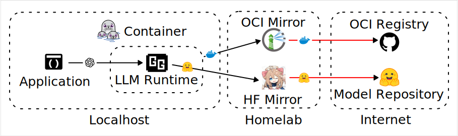
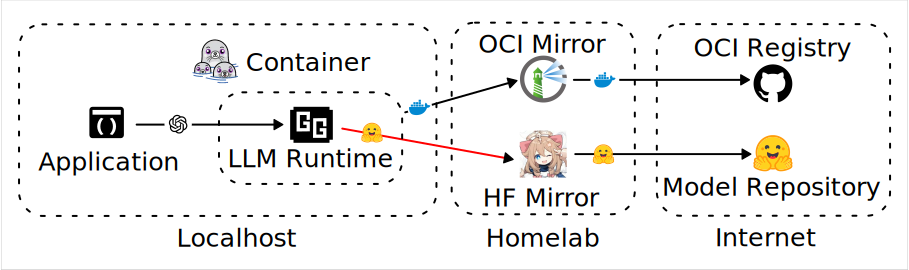
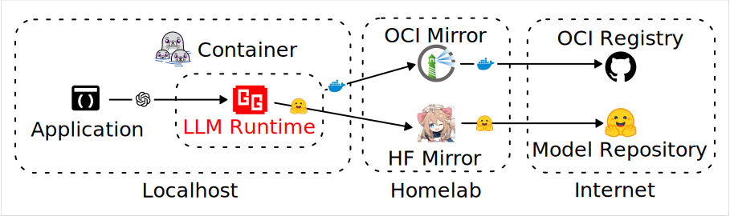
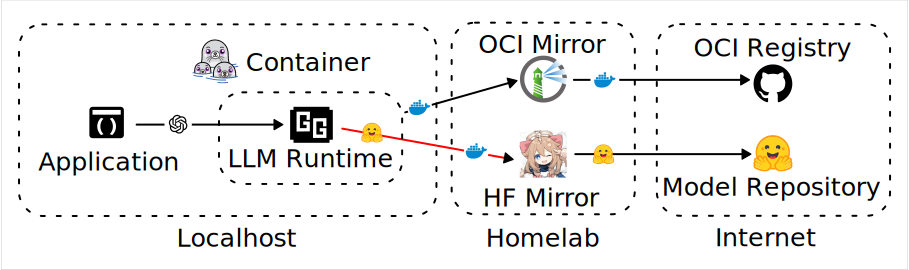
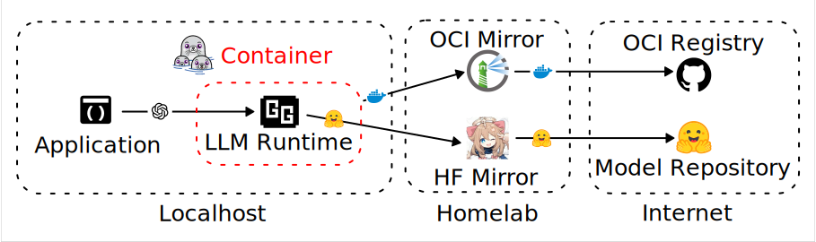

# 最近佈署 LLM 遇到的問題

<head>
  <meta property="og:image" content="https://raw.githubusercontent.com/FlySkyPie/flyskypie.github.io/main/post/2026-06-25_deploy-llm-issues/00_cover.webp" />
</head>


## 前情提要

最近在寫一些小工具，涉及比較敏感的資料，所以不能直接用雲端的 LLM，要用地端/本地的 LLM 處理。過程中遇到一點問題想記錄下來，但是背景有點複雜，建議先閱讀前一篇文章：

[佈署 LLM 的方法 (2026-06-24)](https://flyskypie.github.io/posts/2026-06-24_how-I-deploy-llm/)

預計開發的小工具是這樣的：

1. 透過 inotify 偵測特定資料夾（我是用 Python 的套件 [watchfiles](https://github.com/samuelcolvin/watchfiles)）。
2. 使用 [GNOME Document Scanner](https://gitlab.gnome.org/GNOME/simple-scan) 將我從 EPSON ES-50 掃描的信用卡簽單 pdf 丟進該資料夾。
3. 檔案的變化事件觸發歸檔作業。
4. 先用 OCR 抽取簽單資訊。
5. 再用 LLM 根據嵌端資訊推論歸檔路徑與檔名。
6. 完成歸檔(例如指令路徑：`YYYY/MM/YYYY-MM-DD_{STORENAME}_{AMOUNT}NTD.pdf`)並刪除原始檔案。

不過隨著佈署 LLM 和 OCR 的過程中，謎團越來越多，我只好中止開發先來搞清楚究竟是怎麼回事。

## 無線網路瓶頸



因為我的對外網路是（有限流方案） 4G 無線網路，除了下載速度很感人以外，根據經驗從 Docker Hub 拉取超過 1 GB 的映像檔很高機率會失敗，像這樣：

```shell
$ podman pull ghcr.io/ggml-org/llama.cpp:full-vulkan-b9776
Trying to pull ghcr.io/ggml-org/llama.cpp:full-vulkan-b9776...
Getting image source signatures
Copying blob 4f4fb700ef54 skipped: already exists  
Copying blob d1f56e4c7f2f skipped: already exists  
Copying blob d4a637e5a2c3 [=========>----------------------------] 130.0MiB / 497.0MiB | 458.8 KiB/s
Copying blob 534ac9e261fe done   | 
Copying blob d2bfdcbbb65a done   | 
Copying blob a92b05b64059 [===================>------------------] 120.0MiB / 223.3MiB | 105.4 KiB/s
Copying blob 81e2f2053c8f skipped: already exists  
Error: copying system image from manifest list: writing blob: storing blob to file "/var/tmp/container_images_storage936046123/2": happened during read: Digest did not match, expected sha256:a92b05b640591907c483d83fccf883b9f5d2b4d90369cd44cca5be58bbf7ea8e, got sha256:38656550ac584269f4bff1c74b238fea1d77c997d8439b484f75d803e7952012
```

### llama.cpp 越來越胖了

原本使用 llama.cpp 的原因之一就是它比 ollama 瘦很多，很適合作為微服務使用，不過最近觀察到它越來越胖了：

```shell
$ podman images | grep llama.cpp
ghcr.io/ggml-org/llama.cpp              server-vulkan-b9755    40547717e769  2 days ago     905 MB
ghcr.io/ggml-org/llama.cpp              server-vulkan-b9737    274d563f216f  3 days ago     905 MB
ghcr.io/ggml-org/llama.cpp              server-vulkan-b9102    74d080b604c3  6 weeks ago    538 MB
ghcr.io/ggml-org/llama.cpp              server-vulkan-b8496    33a2ea3a7ef4  3 months ago   530 MB
ghcr.io/ggml-org/llama.cpp              server-vulkan-b8248    954707a036be  3 months ago   502 MB
ghcr.io/ggml-org/llama.cpp              server-vulkan-b8234    4af8b883a4d8  3 months ago   501 MB
ghcr.io/ggml-org/llama.cpp              server-vulkan-b7129    35763dc5caad  7 months ago   428 MB
```

所以我有點擔心它會在不久的將來觸及到我的網路環境極限。無線路由器的升級計畫以及調高無線網路資費方案已經排入待辦事項。

### Gemma 4 很肥

想說現在是 2026 年了，試著用用看性價比評價很高的 Gemma 4 看看，但是即便是 `Q8_0` 量化的 `gemma-4-E2B-it` 也有 5GB 左右。

後來試著抓了 `ggml-org/SmolLM3-3B-GGUF` 來用，`Q4_K_M` 只要 2GB 左右，但是沒開 thinking 的話會笨笨的，連「strawberry 有幾個 r」都會回答錯...

<details>
  <summary>curl Post</summary>

```json
{
  "choices": [
    {
      "finish_reason": "stop",
      "index": 0,
      "message": {
        "role": "assistant",
        "content": "To find the number of r's in the word \"strawberry,\" let's break it down letter by letter:\n\ns-t-r-a-w-b-e-r-r-y\n\nNow, we can look for the letter 'r':\n\n1. The first 'r' appears at the third position.\n2. The second 'r' appears at the eighth position.\n\nSo, there are two 'r's in the word \"strawberry.\""
      }
    }
  ],
  "created": 1782281452,
  "model": "SmolLM3-Q4_K_M.gguf",
  "system_fingerprint": "b8234-213c4a0b8",
  "object": "chat.completion",
  "usage": {
    "completion_tokens": 89,
    "prompt_tokens": 82,
    "total_tokens": 171
  },
  "id": "chatcmpl-dQKDcL7Torw1Y2hGtyKJr9OtD7L0lpHM",
  "timings": {
    "cache_n": 81,
    "prompt_n": 1,
    "prompt_ms": 98.934,
    "prompt_per_token_ms": 98.934,
    "prompt_per_second": 10.10774860007682,
    "predicted_n": 89,
    "predicted_ms": 6249.039,
    "predicted_per_token_ms": 70.2139213483146,
    "predicted_per_second": 14.242189879115813
  }
}
```
</details>

開了 reasoning 可以改善這個問題，不過因為輸出的 token 量變多，所以反應時間會變長：

<details>
  <summary>curl Post</summary>

```json
{
  "choices": [
    {
      "finish_reason": "stop",
      "index": 0,
      "message": {
        "role": "assistant",
        "content": "The word **\"strawberry\"** contains **3** instances of the letter **\"r\"**. \n\nBreaking it down:\n- **Position 3**: \"R\"\n- **Position 8**: \"R\"\n- **Position 9**: \"R\"\n\nSo the total number of r's is **3**. \n\n**Answer:** 3",
        "reasoning_content": "\nOkay, let me try to figure out how many times the letter 'r' appears in the word \"strawberry.\" First, I need to write out the word and look at each letter one by one. Let me start by spelling it out: S-T-R-A-W-B-E-R-R-Y. \n\nAlright, starting from the beginning, the first letter is 'S'. Not an 'r'. Next is 'T', still not 'r'. Then the third letter is 'R'. So that's one 'r'. Let me keep going. After the 'R', we have 'A', then 'W', 'B', 'E', and the next letter is another 'R'. So that's the second 'r'. Then there's another 'R' right after that, making it the third 'r'. \n\nLet me double-check. The word is S-T-R-A-W-B-E-R-R-Y. Breaking it down:\n\n1. S\n2. T\n3. R\n4. A\n5. W\n6. B\n7. E\n8. R\n9. R\n10. Y\n\nSo positions 3, 8, and 9 are 'R's. That would make three 'r's in total. Wait, is that right? Let me count again. Starting from the first letter:\n\n1. S\n2. T\n3. R (1)\n4. A\n5. W\n6. B\n7. E\n8. R (2)\n9. R (3)\n10. Y\n\nYes, that's three 'r's. Did I miss any? Let me visualize the word again. \"Strawberry\" – maybe there's a different way to spell it? No, the correct spelling is S-T-R-A-W-B-E-R-R-Y. The 'r' after the 'w' and the two after the 'e' make three. I don't see any other 'r's in there. So the answer should be three.\n"
      }
    }
  ],
  "created": 1782354762,
  "model": "SmolLM3-Q4_K_M.gguf",
  "system_fingerprint": "b8496-312d870a8",
  "object": "chat.completion",
  "usage": {
    "completion_tokens": 491,
    "prompt_tokens": 262,
    "total_tokens": 753,
    "prompt_tokens_details": {
      "cached_tokens": 0
    }
  },
  "id": "chatcmpl-J02gP2dc5X4IxzJcadTUDxZAOZWpGnvb",
  "timings": {
    "cache_n": 0,
    "prompt_n": 262,
    "prompt_ms": 1341.488,
    "prompt_per_token_ms": 5.12018320610687,
    "prompt_per_second": 195.30551149171666,
    "predicted_n": 491,
    "predicted_ms": 42248.081,
    "predicted_per_token_ms": 86.04497148676171,
    "predicted_per_second": 11.621829640025545
  }
}
```
</details>

要留意，根據官方文件說明，要使用 thinking/reasoning 必須給予 `--jinja` 參數[^ggml-SmolLM3-3B-GGUF]，
但是較舊的 llama.cpp 似乎不支援這個參數，如：`ghcr.io/ggml-org/llama.cpp:server-vulkan-b8248`，關於 llama.cpp 版本的坑後面還會提到更多。

[^ggml-SmolLM3-3B-GGUF]: ggml-org/SmolLM3-3B-GGUF · Hugging Face. https://huggingface.co/ggml-org/SmolLM3-3B-GGUF

## llama.cpp 呼叫 Hugging Face 的行為




大約在 [b8496](https://github.com/ggml-org/llama.cpp/releases/tag/b8496) (2026-04-24) 和 [b9102](#https://github.com/ggml-org/llama.cpp/releases/tag/b9102) (2026-05-11) 兩個版本之間，llama.cpp 從 Hugging Face 上拉取模型的行為發生了變化，具體是哪個版本我懶得調查了。

當使用這樣的參數時：

```yaml
    environment:
      - LLAMA_ARG_HF_REPO=ggml-org/SmolLM3-3B-GGUF
      - LLAMA_ARG_MODEL=SmolLM3-Q4_K_M.gguf
```

`b8496` 以前的版本會使用像這樣的路徑下載：

```
/ggml-org/SmolLM3-3B-GGUF/resolve/main/SmolLM3-Q4_K_M.gguf
```

`b9102` 以後則是會先去呼叫這個路徑：

```
/api/models/ggml-org/SmolLM3-3B-GGUF/refs
```

而 `/refs` 這個 API 在我使用的鏡像方案 [Olah](https://github.com/vtuber-plan/olah) 並未實做。

## llama.cpp 的架構問題



在 Python 的體系中，應用程式和 LLM 模型之間還夾了 SDK、Hugging Face Transform、PyTorch，當某人發布了新的 LLM，它的架構會在 SDK 那層會處理。但是 llama.cpp 只有 C++ 實做和 GGUF 模型，所有架構都必須在 llama.cpp 的 C++ 實作內 hard coding。

這造成了 llama.cpp 支援模型的能力高度被 llama.cpp 的更新進度榜定，例如在 `b8248` 中試圖運行 Gemma 4的話會得到：

```
llm-1  | llama_model_load: error loading model: error loading model architecture: unknown model architecture: 'gemma4'
llm-1  | llama_model_load_from_file_impl: failed to load model
llm-1  | common_init_from_params: failed to load model '/root/.cache/llama.cpp/unsloth_gemma-4-E2B-it-GGUF_gemma-4-E2B-it-Q4_K_M.gguf'
llm-1  | srv    load_model: failed to load model, '/root/.cache/llama.cpp/unsloth_gemma-4-E2B-it-GGUF_gemma-4-E2B-it-Q4_K_M.gguf'
llm-1  | srv    operator(): operator(): cleaning up before exit...
llm-1  | main: exiting due to model loading error
llm-1 exited with code 0 
```

## Docker Registry API V2



`b8496` 以下的版本使用這個配置的話可以正常下載模型：

```yaml
    environment:
      - LLAMA_ARG_HF_REPO=ggml-org/SmolLM3-3B-GGUF
      - LLAMA_ARG_MODEL=SmolLM3-Q4_K_M.gguf
```

但是當需要使用像 `PaddlePaddle/PaddleOCR-VL-1.5` 這樣的模型時，下載一個檔案是不夠的，需要多個檔案才能讓模型在 llama.cpp 內運作：

- `PaddleOCR-VL-1.5.gguf`
- `PaddleOCR-VL-1.5-mmproj.gguf`
- `chat_template.jinja`

這是因為它屬於多模態模型，而不是單純的 LLM，（應該）可以使用以下參數來來下載多個檔案：

```yaml
    environment:
      - LLAMA_ARG_HF_REPO=ggml-org/SmolLM3-3B-GGUF:Q4_K_M
```

但是會出現以下錯誤：

```
error from HF API (http://huggingface.mirrors.solid.arachne/v2/ggml-org/SmolLM3-3B-GGUF/manifests/Q4_K_M), response code: 404, data: {"error":"Sorry, we can't find the page you are looking for."}
```

因為這是 Docker Registry API，而 Olah 沒有實作。

## OCI AI Payload

恩？明明是從 Hugging Face 下載模型，怎麼連 Docker Registry API 都來參一腳了？

稍微搜尋了一下發現這個東西：

https://hub.docker.com/r/ai/gemma4

而且它不能直接用 Podman 下載：

```shell
$ podman pull docker.io/ai/gemma4:E2B
Trying to pull docker.io/ai/gemma4:E2B...
Error: parsing image configuration: unsupported image-specific operation on artifact with type "application/vnd.cncf.model.manifest.v1+json" 
```

原因是這是特殊的 OCI 封裝格式[^model-oci]，據我所知是因為它沒有 roofs 的資訊，必須使用像這樣的指令拉取：

```shell
podman unshare skopeo copy \
  --insecure-policy \
  docker://harbor.mirrors.liquid.arachne/docker-hub-proxy/ai/gemma4:E2B \
  dir:./
```

簡單來說，Hugging Face API 目前雖然作為實質產業標準，但是 CNCF 有意對「怎麼佈署與傳輸類神經模型檔案」訂出標準。

llama.cpp 也支援該界面：

|Argument|Explanation|
| --- | --- |
| `-dr, --docker-repo [<repo>/]<model>[:quant]` | Docker Hub model repository. repo is optional, default to ai/. quant is optional, default to :latest.<br/>example: gemma3<br/>(default: unused)<br/>(env: LLAMA_ARG_DOCKER_REPO) |

如果這個方案可以普及，我的 Olah 就可以退役了，轉而使用更可靠的 Harbor。不過目前只有 Docker Hub 在使用，而 Docker Hub 的流量限制本身就是害我拉大檔案拉不下來的因素之一。

[^model-oci]: model-spec/docs/spec.md at main · modelpack/model-spec https://github.com/modelpack/model-spec/blob/main/docs/spec.md

## OCR 模型表現不穩定

```
[ocr]        | srv  params_from_: Chat format: peg-native
[ocr]        | slot get_availabl: id  3 | task -1 | selected slot by LRU, t_last = -1
[ocr]        | slot launch_slot_: id  3 | task -1 | sampler chain: logits -> ?penalties -> ?dry -> ?top-n-sigma -> top-k -> ?typical -> top-p -> min-p -> ?xtc -> temp-ext -> dist 
[ocr]        | slot launch_slot_: id  3 | task 0 | processing task, is_child = 0
[ocr]        | slot update_slots: id  3 | task 0 | new prompt, n_ctx_slot = 4096, n_keep = 0, task.n_tokens = 1179
[ocr]        | slot update_slots: id  3 | task 0 | n_tokens = 0, memory_seq_rm [0, end)
[ocr]        | slot update_slots: id  3 | task 0 | prompt processing progress, n_tokens = 5, batch.n_tokens = 5, progress = 0.004241
[ocr]        | slot update_slots: id  3 | task 0 | n_tokens = 5, memory_seq_rm [5, end)
[ocr]        | srv  process_chun: processing image...
[ocr]        | encoding image slice...
[ocr]        | image slice encoded in 21944 ms
[ocr]        | decoding image batch 1/5, n_tokens_batch = 256
[ocr]        | image decoded (batch 1/5) in 197 ms
[ocr]        | decoding image batch 2/5, n_tokens_batch = 256
[ocr]        | image decoded (batch 2/5) in 576 ms
[ocr]        | decoding image batch 3/5, n_tokens_batch = 256
[ocr]        | image decoded (batch 3/5) in 335 ms
[ocr]        | decoding image batch 4/5, n_tokens_batch = 256
[ocr]        | image decoded (batch 4/5) in 412 ms
[ocr]        | decoding image batch 5/5, n_tokens_batch = 142
[ocr]        | image decoded (batch 5/5) in 428 ms
[ocr]        | srv  process_chun: image processed in 23892 ms
[ocr]        | slot init_sampler: id  3 | task 0 | init sampler, took 0.01 ms, tokens: text = 13, total = 1179
[ocr]        | slot update_slots: id  3 | task 0 | prompt processing done, n_tokens = 1179, batch.n_tokens = 8
[ocr]        | slot print_timing: id  3 | task 0 | 
[ocr]        | prompt eval time =   24747.40 ms /  1179 tokens (   20.99 ms per token,    47.64 tokens per second)
[ocr]        |        eval time =   93429.63 ms /  2917 tokens (   32.03 ms per token,    31.22 tokens per second)
[ocr]        |       total time =  118177.03 ms /  4096 tokens
[ocr]        | slot      release: id  3 | task 0 | stop processing: n_tokens = 4095, truncated = 1
[ocr]        | srv  update_slots: all slots are idle
[ocr]        | srv          stop: cancel task, id_task = 0
[ocr]        | srv  update_slots: all slots are idle
[ocr]        | srv    operator(): got exception: {"error":{"code":500,"message":"Failed to parse input at pos 0: TQ；的既然既然  既然既然 称即作四作作作�는戒инин 교 교浦に��집집집 அமை作 (ӀэӀэӀэӀэ的的��ده层透明透明ண்டுண்டு羡羡 the the\n\n\n裔5�(，，，�輒放放��貲支����ver.جی顯顯由於宇丁ine  的有เพ阵年是 ilesuணணஸஸ�興�����。那那那ӀэӀэӀэ蚚��图的疾 ..,то角角���ололол���浆â�，，，的的��，，，，的的�，，場从shshdd�，0，，贺的的的的的的\n\n的的200,,,，，，禹.\nmff..，只有在y���转  .，，，争www-----��      iew徒��\n\n\n\n\nimetையில்ையில்ையில்ையில்友ssss ,,,,,,，，，的的���，，的 war and and and and andsw81生\n({{\\市ne季季食生生生生�清清��在在评ans芽lan\n\n\n\n        ���，，，的的的��，，，，,���，，，，,�����-,((���ek of     的的的���，，，00,，，的的的失失失���，，的的的���，，，,,的��，，，99  简称oofCCèге�顯顯韓韓韓韓韓友���的\n�夫夫��与非与非与非与非————��ataadyofofofofof涓,,,niluoppnnnn..，，，，���，，，的的成，ansuu�，，，，，，��，，，\n‌00ofn�.，，，，ிறிறிறிறிற\n1ไ\n\n\n\n\n\n r.�,,,评\n\n\nbu-..-.-首位ofuns党 from\n评gg\n\n\nss\n\n\n\n\n W I I  \n\n\n   \n,.\n\n               in in in in in in in in in e sl  el��      \n\n\n1  ไ\n�.，，，，的��否o�----08��，，\n\n\n\n\n\n1情  \n 妇\n�,，，，，，��，，， or     1 and and and and\n\n\nlot\nر  \n\n\n۹   \n\n\n\n\n\n，，，的���，，，，回归--..，\n\n\n   �,，，的的的�蛛��--         in in\n\n fa以下的    \n ofans\n       F F E E E E连连连新新 F的的的的的的的的 W Group\\.��âè以下的以下的以下的以下的类和�� स्�}}) ,,，，，的wy��域intLLLLLau ,  江江\n\n\n�，，，的的的�� of of of欢欢欢欢G� of of������ 相ǎ� ，，，的的的 I   的的 of\n\n\n\n\nl ,------1111 from,,,, of江,,,,,�u\n\n\n\n\n的的的的1���，，的的的的的��艺� (\n Ю�\n of of\n\n\n\n\nзна�\n\n\n\n\n\n\n W资�， Sc6\n\n\n\n的 मा \n\n\n\n\n\n\nssss的�\n江66666是�和在在在在在在在在       …. or or和111在�n�.., or\n\n决定场场场场生, (\n\n\n\n\n\n         的的��   G G G G,天天天6的的的的的 ( (学习方法omuuu\n11111111���，९和\n\n\n\n\n\n S S C C C C C C C C C C۳\n\n\n\n\n\n\n\n\n\ncc1��，，，，的的的�,的的的的�的的的的的的的的的的的的在在在在恢复正常\n\n1111111��，，，，，的的�不可oooooââ�\n�\n    .222，，，行文文文生生�文\n��连         请\n\n\n\n\n\n在在在�\n\n\n\n\n\n (�\n�大有有有的的的的���，，，，，的的的���，，，，的的法�\n\n\n\n\n\n的�� \n\n\n\n\n\n\n\n\n\\\\\\\\\\\\��，�阵战委天天天天内内非LL在在在在在在在在在在的\n\n的的的的的的的的的�غ行\n\n\n\n\n\n            �����,�1nn0,，，，，的的的 R\n�清有的的的的的的的的的������，，， (\n境\n���\n\n\n C�\n\n and��的的的的的晙�\n\n掉\n\n\n\n\n\n C C C C C C C C C C C C C C C C C C C C C C C C C C C C政政政政政生、,\n天天�掉\n�\n6000,,，，，，的的���， Wh W\n G G G G C C C C C迁迁迁迁 of,    ofลง�WW�WL��\nand暚\n\n\n非非 G Out Out Out未婚汲汲汲汲汲諾諾諾�\n\n\n\nC在在在在在          \n大大的\n\n领域的�\n�，，\n\n\n\n\n\n\n\n\n C C C C C C\n\n\n，,，，，\n\n\n\n\n\n\n\n��0,，，，，，��，，，，\n\n\n\n\n\naaaasssss\n�城amâéâââ以下的以下的以下的以下的法和类和 स् WIลงорт政政质质质�\n\nSکن�\n\n\n\n\nandR�.生生\n\n\n\n\n\n\ngauauorotimesotimesotimes.—.—.—諾諾諾諾諾â��,， and天天\n\n�0,，，，，，，\nธ� .,，，，，，的 of of of ofofofofofof灰灰灰\nand��0，\n\nandand�艺\n\n\n\n\nandR�生失失\n\n\n\n\n\n\n in in in in in in in in in in\n\n\n\n\n的的的的的在在在在在前前前前前在âi�n�,,,，资格\nธâl�.艺\n\n���000，，，\n\n\n\n\nธR .��财非非非非非非非非非\n生生\n\n��0,,，，，�ab99�ââ�，，，生生生生生城\n\n\n\n\n\n\naaaaaa C C C C C e e e e e e e评,\n\n\n\n\n\n\n\n6R政\n\n\n\n 함 함 함 함 of of of ofofofofofofofofer\n\nWGGGLL\n\n\n\nGâéâè以下的以下的以下的法和\n\n\nธ城城�开工� and���iideideideideideideararauâ\n\n\n\n\n\n\n\n在在在在在����，ans\n\n\n\nâââ以下的以下的以下的类和类和类和 Duranteवन\n\n\n\nââ\n\n\n\n\n0、生行\n�â�以下的以下的ons域域域000\n\n\n\n\n\n\n\n旧旧旧旧otimes���er掉\nâand and\n\n�âant and and,�行�ââân�,,，的�\n\n\n\n\naa000I的的的的的的的的的的的的的的的的���नानाना新新ererer低估低估汲汲汲汲\n\n\n\n\n\n\n C C C C C C C C C C C C C C���兽骏骏 함 함 함 함 함secsecsecsec骏骏骏 文\n�â�\n\n\n\n\n�R���\n\n\n\n跨跨跨跨��\n\n\n\naaaaaarerereotimes汲汲ना\n (院\n\n\n\n\n\n11111���\n\n�����\n\n\n\n\n\n\n中的的的的的�â�\n\n�\n\n�\n\n\n0���(\n\n\n\n\n\n\n\n\n\n\n\n\n\n在在在在在在在在在在的的的的��and�\n\n\n\n\n\n\nG新新在在在在在在在在在的1���RR2�，\n�\n\n\n\n\n\n\n\n\n  ��，，，，，\n\n\n\n\n\n\n\n12��，，，，，的的的�\n\n\n\n\n\nG，，，，，\n\n(R�\n\n\n\n\n\n\n非非非非非icic,�âââ以下的以下的以下的以下的以下的类和类和� Durante\n�0，,，，，，���\n\n\n\n\n\n,1�\n\n\n\n\n���90，，，，的的的的�\n\n\n\n\n�RRRnnnnnnnRFnnn，，，，，，的的���，，，，，的�\n\n\n\n\n\n (RRR者\n\n\n\n\ng新在在在�\n\n\n\n\n\n\n\n在在�\n��111\n\nธ�大大的的的在龙\n\n\n\n\n\n (\n���有有有有境言go\nate\n\n\n\n\n\nL1111���，\n�\n�，\n\n�有\n�\n�要要要要nnnF在在在FF1��，，，，的的���，，，，�\n\n\n\n\n\n\n\n\n在在在在在在在在在在在在在在在在在在在在在1���，，，言言L�i�âââââ  âand櫫��ââ�\n���âââ\n\n\n\n\nG，，，۹�艺艺艺����������城城�\n������������言境\n66��â��，\n\n�\n�艺�\n���，，，，，的����â\n\n�éâ以下的以下的以下的一向�\n\n\n�\n��\n�������������â��，，","type":"server_error"}}
[ocr]        | srv  log_server_r: done request: POST /v1/chat/completions 10.89.62.26 500
```

有的時候 `PaddleOCR-VL-1.5-GGUF` 會異常，原因未知。

## llama.cpp 快取失蹤

這個參數不會下載到 `/root/.cache/llama.cpp`，而是直接放在 `/app` 之下：

```yaml
    environment:
      - LLAMA_ARG_HF_REPO=ggml-org/SmolLM3-3B-GGUF
      - LLAMA_ARG_MODEL=SmolLM3-Q4_K_M.gguf
```

這個才會，volume 設定才有用：

```yaml
    environment:
      - LLAMA_ARG_HF_REPO=ggml-org/SmolLM3-3B-GGUF
      - LLAMA_ARG_HF_FILE=SmolLM3-Q4_K_M.gguf
    volumes:
      - data:/root/.cache/llama.cpp
```

## 模型下載問題



前面講的多模態檔案可以用以下配置解決：

```yaml
services:
  downloader:
    image: docker.io/huggingface/downloader:0.17.3
    entrypoint: ["sh", "-ec"]
    command:
      - |
        echo "Download model... ";
        huggingface-cli download "PaddlePaddle/PaddleOCR-VL-1.5-GGUF" \
                  --include "PaddleOCR-VL-1.5-mmproj.gguf" "PaddleOCR-VL-1.5.gguf" "chat_template.jinja" \
                  --cache-dir=/hf-cache \
                  --local-dir=/data/PaddleOCR-VL-1.5-GGUF \
                  --local-dir-use-symlinks=False
    volumes:
      - model-cache:/data
      - hf-cache:/hf-cache
  ocr:
    image: ghcr.io/ggml-org/llama.cpp:server-vulkan-b8248
    restart: always
    devices:
      - /dev/dri/:/dev/dri/
    ports:
      - 8080:8080
    entrypoint: /app/llama-server
    volumes:
      - model-cache:/data
    environment:
      - LLAMA_ARG_MODEL=/data/PaddleOCR-VL-1.5-GGUF/PaddleOCR-VL-1.5.gguf
      - LLAMA_ARG_MMPROJ=/data/PaddleOCR-VL-1.5-GGUF/PaddleOCR-VL-1.5-mmproj.gguf
      - LLAMA_ARG_CHAT_TEMPLATE_FILE=/data/PaddleOCR-VL-1.5-GGUF/chat_template.jinja
      - LLAMA_ARG_WEBUI=disabled
      - LLAMA_ARG_N_GPU_LAYERS=all
      - LLAMA_ARG_CTX_SIZE=20000
      - LLAMA_ARG_TEMP=0
      - LLAMA_ARG_JINJA=1
      - LLAMA_ARG_FIT=off
    depends_on:
      downloader:
        condition: service_completed_successfully
    healthcheck:
      test: ["CMD", "curl", "-f", "http://localhost:8080/health"]
      interval: 10s
      timeout: 20s
      retries: 3

volumes:
  model-cache:
  hf-cache:
```

一個容器專門跑下載，另外一個容器專門運行模型。不過這個配置有兩個問題：

- 在 docker compose 可以正常運作，但是 podman compose 對於 `depends_on` 的支援度不夠高因此不會按照預期的順序啟動容器。
- 我可能還沒找到正確配置 `huggingface-cli` 指令的方式，即便檔案已經存在它也不會自動忽略而是重新下載一次。
