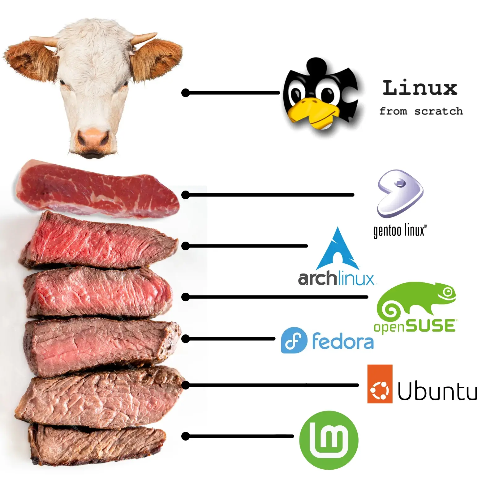

# OpenBMC 的歷史

<head>
  <meta property="og:image" content="https://raw.githubusercontent.com/FlySkyPie/flyskypie.github.io/main/post/2026-07-11_openbmc-history/01_linux-beef.webp" />
</head>

最近在學習 OpenBMC，於是爬了一下它的歷史，有點意外跟傳說中的 Gentoo 扯上關係。年份僅供參考，只是用來做相對時間順序的比較之用。

---

- FreeBSD Ports collections，於 1994 年發布。
- Portage 是 Gentoo 的包管理器，Gentoo 於 2002 年發布，高度參考 FreeBSD 的 Ports。
- Linux Foundation 在 2010 年宣佈 Yocto；2011 正式啟動。
- OpenEmbedded 社群起源於 2003 年，在 2011 年建立 OpenEmbedded-Core 與 Yocto 合作。
- BitBake 由 OpenEmbedded 開發，於 2004 年釋出，啟發自 Gentoo 的 Portage。
- 2015 年 IBM 使用 Yocto 建立 OpenBMC 專案。
- 2018 年 Linux Foundation 建立了OpenBMC 計畫，並繼承 IBM 時期的技術棧。

(其他補充野史)

- Linux From Scratch 1999 年初版。
- Buildroot 發布於 2005 年。
- Facebook 於 2014 年使用 Buildroot 建立自己的 "OpenBMC"。

## 補充

有些人可能會困惑為什麼我要特別提及 Linux From Scratch 跟 Gentoo 兩個跟 OpenBMC 沒有直接關聯的東西。

大部分人使用應用程式都是直接從某個地方下載執行檔然後使用，也就是預建置 (pre-build) 二進制檔案，Linux 的大部份發行版也是如此，然而 Open source 的圈子內有一種概念：

> 我沒看到原始碼，我不放心。

所以 Gentoo 的邏輯就是「所有東西都從原始碼編譯的 Linux 發行版」。

Linux From Scratch 定位則比較像是教科書，讓人更了解如何自己親手操作獲得 Linux，但是歷史悠久，因此後進的 Linux 使用者即便沒有親自動手做一遍也會有所耳聞。

所以「從 source 編譯 Linux」這件事情對我而言具有神聖的色彩，感覺是只有真正的太古神獸或是大佬才知道的事情。

然而入職的第一周，「恩？你說我剛剛已經從頭編譯一個 Linux 了？」。

---

另外，如果仔細觀察，會發現每一個企劃發起的時間都比它實際使用的工具來得近代；換句話說，這些計畫都沒有自行開發一套解決方案，而是直接使用已經存在的解決方案進行統整。

雖然經常覺得自己站在巨人的肩膀上，但是即便是這些巨人似乎也是站在其他巨人的肩膀上呢。
