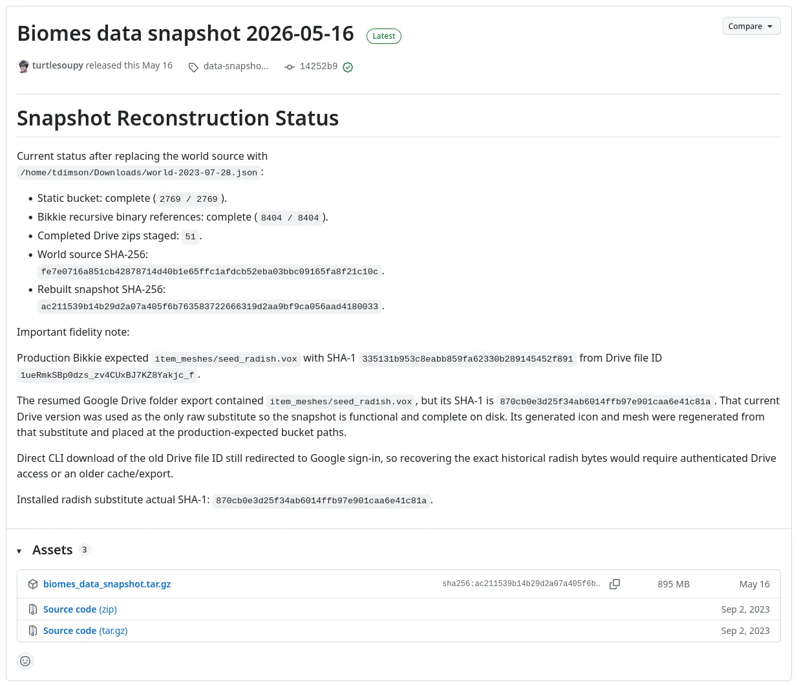

# Biomes 研究筆記 8

<head>
  <meta property="og:image" content="https://raw.githubusercontent.com/FlySkyPie/flyskypie.github.io/main/post/2026-07-12_biomes/00_cover.webp" />
</head>

## 前情提要

請見：[Biomes 研究筆記 7](https://flyskypie.github.io/posts/2025-12-24_biomes/)

## Zod Schema

Biomes 的 `shared` 模組中定義了很多資料，當中不少檔案是超過 500 行的，並且不少有循環仰賴：

```typescript
export const zBiscuitAttributeAssignment = z.lazy(
  memoize(() =>
    z.discriminatedUnion("kind", [
      zParentTrayAssignment,
      zConstantAssignment,
      zReferenceAssignment,
      zUnassignment,
      zInferenceAssignment,
    ])
  )
) as ZodType<BiscuitAttributeAssignment>;

export const zParentTrayAssignment = z.object({
  kind: z.literal("parentTray"),
  to: zBiscuitAttributeAssignment,
});
```

為了對仰賴關係有更細的理解，避免太多東西被 `import`，而把定義資料檔案拆成獨立的檔案，然而循環仰賴會造成 runtime error。

加上很多型別是用 Zod 的 schema 本身進行推論的：

```typescript
export const zShotMetadata = z.object({
  coordinates: zVec3f,
  cameraLookAt: zVec3f.optional(),
  shotInMinigameId: zBiomesId.optional(),
  shotInMinigameInstanceId: zBiomesId.optional(),
  shotInMinigameType: zMinigameType.optional(),
});

export type ShotMetadata = z.infer<typeof zShotMetadata>;
```

造成仰賴 `type` 的時候依然會 `import` 到實作，加劇了循環仰賴的問題。

## 由上而下的嘗試



五月份的時候有 Biomes 的內部人員修復了素材包缺失的問題，原本該專案自動化腳本會去 GCP 下載預先打包的素材包，但是該資源已經無法被訪問，修復的內容就是在 GitHub 上 release 一份，並且更新自動化腳本。

在這之前我是以由下而上，從仰賴鏈末端的基本元件慢慢重構與編譯往上組合的。既然原始團隊的人已經做了一些修復並且聲稱自己測試過可以運行，我就試著由上而下跑跑看吧。

### Bob

Biomes 的程式碼可以看到不少名為 Bob 的東西：

```
├── deploy/
│   └── k8/
│       └── services/
│           └── bob.yaml
├── Dockerfile.bob
├── scripts/
│   └── deploy_bob.sh
└── src/
    └── server/
        └── bob/
```

因為最後是以 Docker 的形式存在，K8s 編排內也有，我之前一直以為這是遊戲本體的內部代號，最近仔細看了一下實作才知道它是手搓的自動化程式，被擬人化為一個名為 Bob 的 Agent。

這個程式在做的事情就是輪詢 Git、運行 Bazel 與 Docker (DnD)、推送映像檔、觸發 Discord 通知...等。給人一種「不知道 CI/CD 為何物的前端仔用 Typescript 搓出來的東西」的感覺。

### GCP 重度仰賴

程式運行後會被 GCP/Firebase 的鑑權擋住，仔細查看程式碼會發現實作高度耦合 BigQuery、Firestore、GCP Storage、App Engine...等 Google 的服務。

幾乎可以想見該團隊被微軟體系的 OpenAI 收購之後會有什麼樣的衝擊。

### 過期的進入點

調查 `Dockerfile.bob` 和 `Dockerfile.biomes` 的建構流程會發現明顯有設計 Next.js 和 Webpack 的建置流程。

但是調查 K8s 設定會看到諸如這樣的內容：

```yaml
      containers:
        - image: us-central1-docker.pkg.dev/zones-cloud/b/biomes:devin-deploy-2
          name: biomes
          args:
            - '-r'
            - ts-node/register
            - src/server/gaia_v2/main.ts
            - '--bikkieCacheMode'
            - redis
            - '--biscuitMode'
            - redis2
            - '--chatApiMode'
            - redis
            - '--firehoseMode'
            - redis
            - '--serverCacheMode'
            - redis
            - '--storageMode'
            - firestore
            - '--worldApiMode'
            - hfc-hybrid
            - '--simulations'
            - restoration
            - lifetime
            - ore_growth
```

所有微服務都是不經過建置，直接用 Typescript 運行的。由此可知程式碼內部有嚴重的割裂，不同時期的進入點同時存在，可能還有不少類似的廢棄程式碼存在。

## 小結

由上而下大概是走不通的路線，因為必須要建立完整的 GCP 專案以及完整的 K8s 服務簇才有可能把程式跑起來，跟 GCP 的仰賴又有嚴重耦合，很難透過簡單的重構抽換成其他替代微服務。
