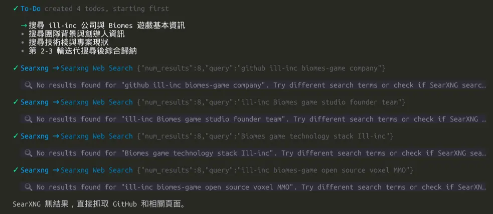
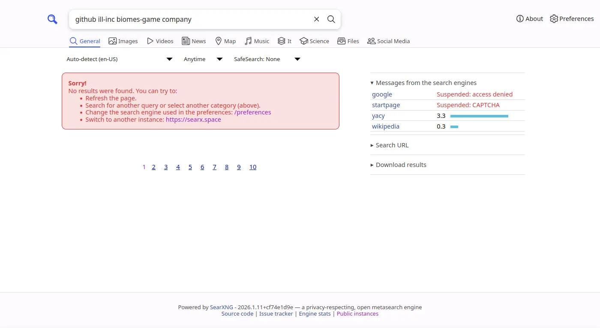
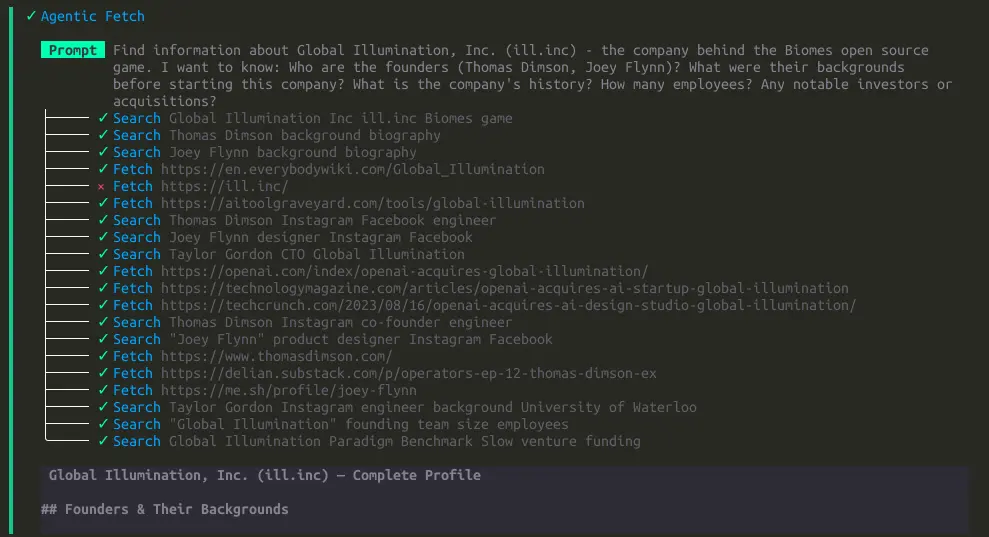
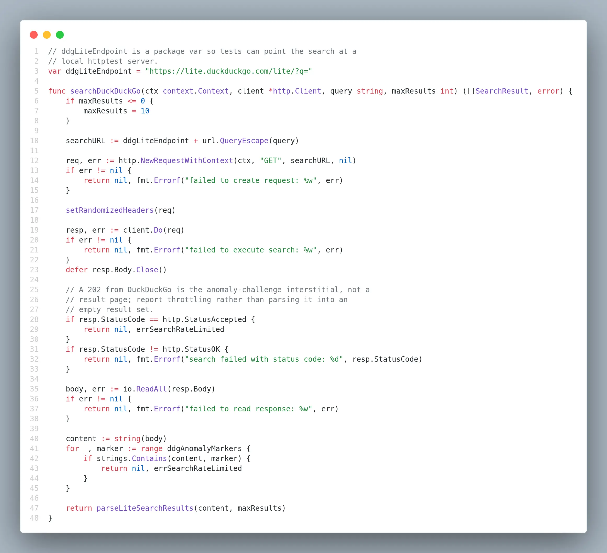

# Agentic 網路訪問雜記

<head>
  <meta property="og:image" content="https://raw.githubusercontent.com/FlySkyPie/flyskypie.github.io/main/post/2026-08-24_agent-search/01_crush-searxng.webp" />
</head>

最近開始試著使用 CLI/TUI 的 LLM Agent 工具，選擇了 [crush](https://github.com/charmbracelet/crush)。

然後想把之前在 [Local Deep Research](https://github.com/LearningCircuit/local-deep-research) 的使用習慣轉移過來，原因是 Local Deep Research 彈性略差，加上它的主要賣點之一是研究內容在伺服器端是加密的，但是這個設計造成 UX 上的缺陷：光是開啟清單頁面都需要運行解密而造成網頁會花不少時間在等待解密完成。

把 Local Deep Research 的提示詞抽出來隨便搓了一個 Skill:

https://github.com/FlySkyPie/simple-research-skills

但是發現了一個問題：

恩？為什麼我架的 SearXNG 看起來都搜不到東西？是 MCP 壞掉了嗎？

原來是被搜尋引擎擋了。

但是 crush 的內建工具為什麼可以運作？

翻了一下程式碼發現它是使用鴨鴨 (DuckDuckGo)：

有趣的是，當時 DuckDuckGo 算是第一個在我的 SearXNG 會擋機器人的搜尋引擎，因此它很早之前就被我從 SearXNG 的設定中停用了。
