# Agnetic Tool 調查筆記

<head>
  <meta property="og:image" content="https://raw.githubusercontent.com/FlySkyPie/flyskypie.github.io/main/post/2026-09-06_openhands-review/01_agent.webp" />
</head>

## 前因

我使用 Agnetic Coding 工具的歷程是從 VSCode 開始的，畢竟我就是個 GUI 仔，先後嘗試了 [Cline](https://github.com/cline/cline) 和 [Kilo](https://github.com/kilo-org/kilocode)，我沒有很喜歡專屬 IDE 整合的方案，一方面是會破壞原本的使用習慣，即便它們大部分都是基於 VS Code，但是細微的調整也會帶來日常使用的摩擦，就像不稱手的廚具。

:::info
關於 Agent/Agentic 的概念可以看我之前文章的解釋：

[Agent! Agent! Agent! 所以 Agent 到底是什麼？](https://flyskypie.github.io/posts/2026-03-17_llm-agent/)
:::

使用過程不可避免的發現了一些體驗的問題，首先是對話視窗佔據了專注力，同時 Agent 不斷的操作帶來的畫面變化與閃爍，實際上就是把開發者從工具台上踢開，讓人類看著 LLM 表演，即便 LLM 有分攤工作的能力，在一個 IDE 上實際上同時只能有一個使用者：人類或 LLM。

另一方面，如果留意 CPU 使用量的話，LLM 不斷更新 IDE 上的內容，造成大量的 AST (Abstract Syntax Tree) 重新解析與渲染運算，老實說很浪費算力。

更重要是，IDE 容易讓 LLM 淹沒在非必要的訊息流之中，例如風格警告 (Linter)，這些是可以透過工具自動修復的，但是 LLM 感知到了錯誤或警告訊息就會試圖「手工」修復它，從而浪費不要的 Token 以及造成專注點漂移。

這些基本上是我僅嘗試，但是尚未大量使用的原因，直到今年 (2026) 七月發生了一些變化。

---

找到新工作之後，我必須面對的第一個挑戰就是我已經長達五年無須在日常使用 Windows，但礙於公司制度的問題，我不得不使用公司配發的 Windows 電腦，同時工作環境充斥著 Agent，不只是同事人均手持 Agentic Coding，公司本身也在大力推廣使用，


慶幸的是工作本身大部份是在遠端連線到的 Linux 伺服器上完成，這個變化反而刺激了我學習使用 `tmux` 之類原本在 Linux GUI 上沒有動力使用的東西，另外就是公司配發的 Agnetic 方案，所也索性直接用 Terminal 運行了，IDE 單純拿來**給人類使用**。另外一個變化是 DeepSeek V4 Flash 正式把堪用的智力水準壓到合理的價格範圍，從我的使用紀錄就可以感受到（上圖是過去一年的消費金額，下圖則是 token 用量）：

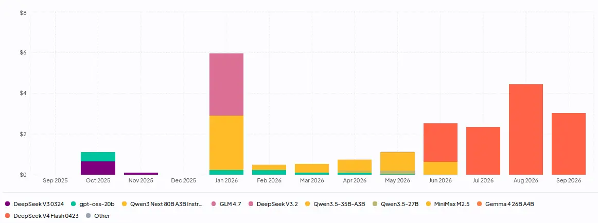

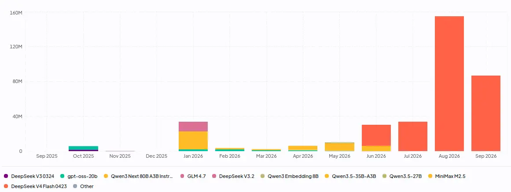

於是下班之後，我也試著尋找 Terminal 上運行的 Agnetic Coding 工具，使用編譯語言實作是當時的第一考量，先後嘗試了 [Goose](https://github.com/aaif-goose/goose) 和 [Crush](https://github.com/charmbracelet/crush)，第二個考量是「支援 OpenAI Compatible API」，Goose 因為沒能快速的完成設定，而 Crush 卻很快就完成設定，就一直用到現在了。

---

Crush 作為我的日常使用 LLM Agent 工具一個多月了，整體而言還算滿意。這個週末想做一個規模不小（~100 個檔案）的工程文件翻譯任務，這類任務最好在有支援 subagent 的工具下處理，然而 subagent 是 Crush 用戶吵著需要很久但遲遲沒有加入的功能：

- [feat: subagents #431](https://github.com/charmbracelet/crush/issues/431)
- [Add Subagents _please_ #1807](https://github.com/charmbracelet/crush/issues/1807)
- [feat(subagents): add subagents system - #3098](https://github.com/charmbracelet/crush/pull/3098)

想著我現在已經有了 Cursor CLI、Kiro CLI、Cursh 三種 CLI/TUI Agent 工具的使用經驗了，或許該看看其他開源方案，或許有比 Crush 更好用的？（先講結論，目前還沒找到，後面會補充一點原因）

## 各種 CLI/TUI

於是先後調查了一些方案：

- [aaif-goose/goose](https://github.com/aaif-goose/goose)
- [Hmbown/CodeWhale](https://github.com/Hmbown/CodeWhale)
- [anomalyco/opencode](https://github.com/anomalyco/opencode)
- [earendil-works/pi](https://github.com/earendil-works/pi)
- [Cline CLI](https://github.com/cline/cline/blob/main/apps/cli/README.md)

Goose 和 CodeWhale 是相對冷門的方案，先被選中的原因是稍早提到的性能考量，一些需求無法被滿足才又選了 OpenCode 兩個 Pi 用 Typescript 實做但是比較知名的方案。

它們大部分在「支援 OpenAI Compatible API」這個前提上大多都存在問題，不過既然現在我手上有 Crush，讓一個 Agnetic Tool 去設定另外一個 Agnetic Tool 本身不是什麼大問題，另外一個問題的是權限控制。

---

這裡需要回過頭來解釋一下 Agnet 的基本特性：

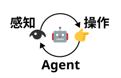

Agent 是一個由感知和操作建立起來的循環運算（運算過程會有上下文堆積的問題，不過這裡先不考慮），因此 Agent 的能力除了 LLM 的性能以外，主要受到「它能感知什麼？它能操作什麼？」的限制。

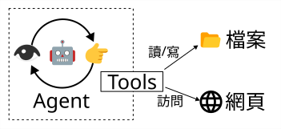

Agent 與檔案、網頁之間的交互是透過一個名為 Tools 的東西進行的，這個 Tools 可以是軟體自行實做的，也可以是透過 MCP (Model Context Protocol) 接入的。

對於怎麼實做這個 Tools，出現了設計哲學上的差異，第一種是「簡單至上，Bash 搞定一切」：

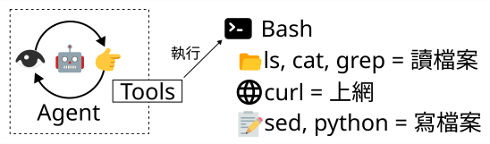

第二種是嚴格區分，各自實做：

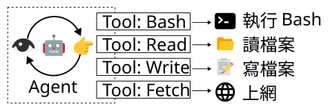

兩者不是互斥的，只是在觀察工具時，可以發現它們的設計哲學比較傾向哪一方。

---

當 Agent 呼叫 Tools 時，能夠被實做 Agent 的軟體攔截，並且只在獲得人類許可的情況下執行，不論是「感知」還是「操作」，以 Crush 為例，互動畫面如下：

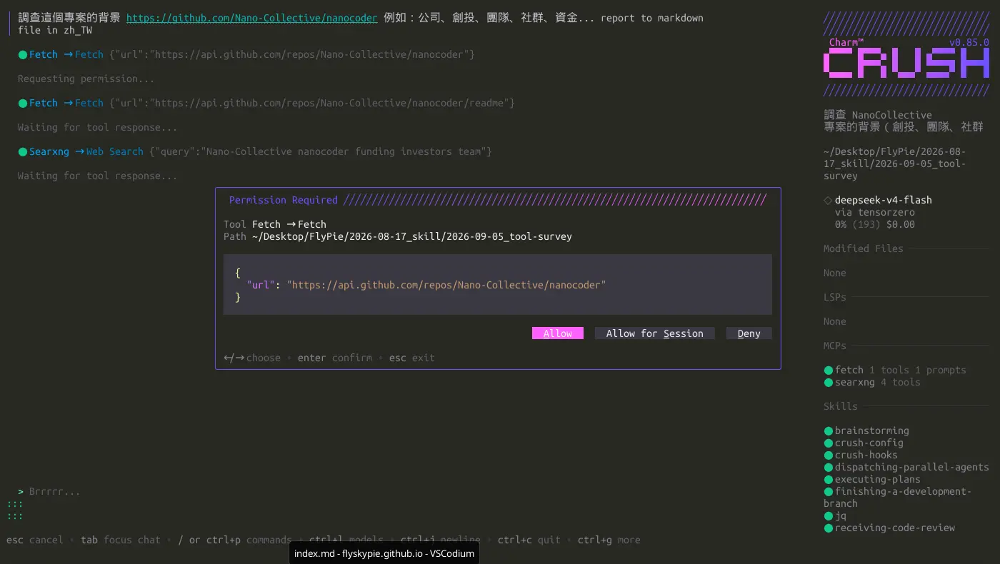

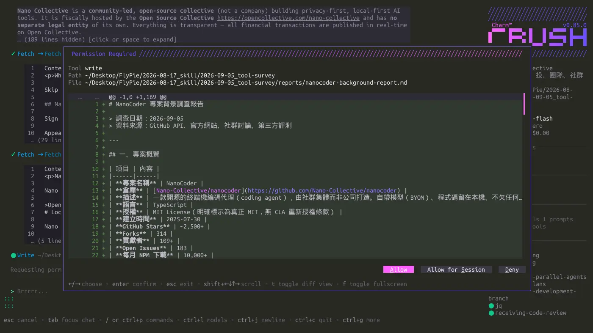

這類權限控制也可以透過組態檔完成，例如：

```json
// ~/.local/share/crush
{
  "$schema": "https://charm.land/crush.json",
  "permissions": {
    "allowed_tools": [
      "agentic_fetch",
      "fetch",
      "mcp_fetch_fetch_html",
      "mcp_fetch_fetch_json",
      "mcp_fetch_fetch_markdown",
      "mcp_fetch_fetch_readable",
      "mcp_fetch_fetch_txt",
      "mcp_fetch_fetch_youtube_transcript",
      "mcp_searxng_searxng_instance_info",
      "mcp_searxng_searxng_search_suggestions",
      "mcp_searxng_searxng_web_search",
      "mcp_searxng_web_url_read",
      "sourcegraph"
    ]
  }
}
```

發現問題了嗎？

第一種方法實做起來比較簡單，使用上也比較自由，很容易讓 Agent 獲得強大的能力來解決問題，而不用人類去操作諸如複製或貼上的繁瑣任務，但是權限控制幾乎形同虛設，即便可以偵測之如 `rm` 之類的危險指令，這種問題防不勝防，對資安有點概念的人就知道「拿到執行任意指令的權限」有多嚴重，即便不是來自攻擊者，LLM 也有可能在長時間的背景運作與嘗試中找到漏洞 (Exploit) 來通過腳本檢查，Agent 可能帶來的影響 (Side Effect) 基本上無法預測。

---

從 Crush 的截圖我們可以發現它被設計了三種選項：

- 允許這次操作
- 在這一輪對話 (Session) 中允許
- 拒絕

而若想要永久自動允許則是在配置檔上設定。

不少工具缺少第二個選項，如此一來使用者被迫在「頻繁審核工具操作」與「放任自由操作帶來的危險」之間選一個。又或是提供過濾的可能性，但是需要自行撰寫插件來達成。

另外如果工具設計哲學是向 Bash 傾斜的，提示詞有可能讓 Agent 傾向執行 Bash 而不是呼叫其他準備好的工具，這會在 Human in Loop 使用體驗上帶來摩擦。

---

這個調查引出了另外一個問題—網路能力。

目前我的 Crush 配置是這樣的：

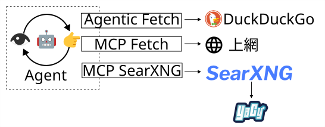

:::info
SearXNG 和 YaCy 是我的 homelab 基礎設施，詳情請見另外一篇文章：

[自架搜尋引擎套餐 (YaCy + SearXNG + Local Deep Research)](https://flyskypie.github.io/posts/2026-01-12_search-engine/)
:::

MCP 是我另外配置的，整個網路訪問能力可以視作具有冗餘的系統：

- 透過 SearXNG 可以訪問諸如 Google 之類的搜尋引擎
- 當被限制時降級成本地檢索的 YaCy
- 當 YaCy 不足以回答問題時，使用 Crush 內建的工具來訪問 DuckDuckGo

為什麼網路搜尋/訪問能力很重要？因為當 Agent 可以訪問網際網路時，基本上就形成了一個廣義的 RAG (Retrieval-Augmented Generation) 系統，它的能力能夠被大幅的提昇，然而進入 LLM 時代之後，這些巨型公司不斷的搜刮網際網路上的資訊（爬蟲），搞得人心惶惶，許多網站紛紛蓋起阻擋機器人的城牆，不論是透過 Cloudflare 還是 [Anubis](https://github.com/techaroHQ/anubis)，另一方面各個主流搜尋引擎實質是由寡頭架構控制的。

網路訪問能力對於「使用 LLM 的開源陣營」而言是一個不可忽略的問題，意外的是，除了 Crush，我沒有看到其他 (CLI) 工具有內建網路搜尋/訪問能力，它們大多假設給予 Bash 使用 `curl` 就能解決問題。

## 隔離

回到這個調查一開始的目的： Subagent，

:::info
Subagent 就是上面那個 Agent 循環圈圈變成很多個。
:::

Subagent 帶來的另外一個問題是，它會讓權限控制變得更麻煩，加上我對於其他工具的權限控制不盡滿意，那麼換個想法：把一堆不受控制的 Agent 扔進隔離環境，總該可以了吧？

於是朝著 "隔離 Agent" 這條路調查，兩個方案出現在我眼前：

- [nolabs-ai/nono](https://github.com/nolabs-ai/nono)
- [OpenHands](https://github.com/OpenHands/OpenHands)

快速看了一下，nono 似乎是真的站在資安角度建構的工具，需要在一個配置好的 Profile 下運作，雖然支援像 opencode 這樣的熱門工具，是否支援或是要自己調整給 Crush 用，想想就覺得麻煩，於是打算先試試 OpenHands。

## OpenHands

### DevOps 工程

OCI (Open Container Initiative) 映像檔是是我對 selfhosted 專案必評點的項目之一。

首先是一個不太符合微服務約定的巨型映像檔：

```
REPOSITORY                      TAG         IMAGE ID      CREATED     SIZE
ghcr.io/openhands/agent-canvas  1.16.0      1c8fd589ca36  9 days ago  4.14 GB
```

用指令自動重試了一整個晚上姑且還是拉下來了：

```shell
until podman pull ghcr.io/openhands/agent-canvas:1.16.0; do sleep 10; done
```

:::info
眾所周知（？）我的對外網路是無線網路，映像檔太大的話會完全拉不下來。
:::

在單一容器運行多個背景程式，處理的方式就不是很優雅了：

<details>
  <summary>`/opt/agent-canvas/entrypoint.sh`</summary>

```bash
#!/usr/bin/env bash
# ═══════════════════════════════════════════════════════════════════════════════
# agent-canvas all-in-one entrypoint
#
# Starts three services (plus an optional fourth):
#   1. Agent Server   on port $AGENT_SERVER_PORT  (default 18000)
#   2. Automation     on port $AUTOMATION_PORT     (default 18001)
#   3. Static server  on port $PORT               (default 8000)
#      Routes /api/automation/* → automation, /api/* → agent-server,
#      and serves the frontend static build for everything else.
#   4. (Optional) Public-mode static server on $PUBLIC_MODE_PORT
#      Same frontend, but with --auth-required (no baked session key).
#      Used by auth-mode E2E tests. Only started when PUBLIC_MODE_PORT is set.
#
# Environment variables:
#   PORT                 – Unified entry point port (default: 8000)
#   AGENT_SERVER_PORT    – Internal agent-server port (default: 18000)
#   AUTOMATION_PORT      – Internal automation port (default: 18001)
#   AGENT_CANVAS_BASE_PATH – Static frontend mount path (default: /canvas)
#   VSCODE_PORT          – Internal editor port (default: 8001). The image does
#                          not EXPOSE it and the editor is reached through
#                          VSCODE_BASE_PATH on $PORT, but openvscode-server
#                          binds 0.0.0.0, so `docker run --network host` does
#                          leave it directly reachable with only its connection
#                          token in front of it.
#   VSCODE_BASE_PATH     – Path prefix the editor is served under on $PORT
#                          (default: /vscode). Exported to agent-server as
#                          OH_VSCODE_BASE_PATH and routed by the static server.
#                          agent-server's own OH_VSCODE_PORT / OH_VSCODE_BASE_PATH
#                          take precedence over these aliases; whichever is set,
#                          one effective pair drives both the editor process and
#                          the proxy route.
#   PUBLIC_MODE_PORT     – If set, starts a second static server on this port
#                          with --auth-required (no session key injected)
#   OH_SECRET_KEY        – Secret key for settings encryption (auto-generated
#                          and persisted if not provided)
#   OPENHANDS_AUTOMATION_API_KEY – Override automation backend auth key
#                          (defaults to session API key — both backends
#                          use the same `X-Session-API-Key` header)
#   AUTOMATION_AGENT_SERVER_URL  – URL the automation service uses to reach the
#                          agent-server (default: http://127.0.0.1:AGENT_SERVER_PORT).
#                          Setting this enables local-mode auth so the session
#                          API key is validated internally instead of against the
#                          OpenHands cloud API.
#   FILE_STORE             – Storage backend for automation tarballs (default: local).
#                          Without this the automation backend may fall back to
#                          S3/GCS which fails without cloud credentials.
#   LOCAL_STORAGE_PATH     – Directory for local file storage (default: ~/.openhands/storage)
#   AUTOMATION_BASE_URL    – Publicly-reachable base URL for the automation
#                          service, used in callback URLs and injected into
#                          sandboxes (default: http://127.0.0.1:$PORT).
#                          Override in production when the external URL differs.
#   AUTOMATION_WORKSPACE_BASE – Directory for automation run workspaces
#                          (default: ~/.openhands/workspaces)
#   Any agent-server or automation env vars are passed through.
# ═══════════════════════════════════════════════════════════════════════════════
set -uo pipefail

log() { printf '[agent-canvas] %s\n' "$*"; }
log_error() { printf '[agent-canvas] ERROR: %s\n' "$*" >&2; }

# ── Load centralized defaults (generated from config/defaults.json at build) ─
# shellcheck source=/dev/null
if [ -f /opt/agent-canvas/defaults.env ]; then
  # shellcheck disable=SC1091
  . /opt/agent-canvas/defaults.env
fi

PORT="${PORT:-${CONFIG_PROXY_PORT:-8000}}"
AGENT_SERVER_PORT="${AGENT_SERVER_PORT:-${CONFIG_AGENT_SERVER_PORT:-18000}}"
AUTOMATION_PORT="${AUTOMATION_PORT:-${CONFIG_AUTOMATION_PORT:-18001}}"

# The bundled editor is reached through a path prefix on the proxy port rather
# than a published port of its own. The same prefix has to reach agent-server
# (it launches openvscode-server with --server-base-path and advertises the
# prefix from /api/vscode/url) and the static-server route table below, or the
# advertised URL and the route serving it disagree.
#
# Two env var names reach the same setting: OH_VSCODE_PORT / OH_VSCODE_BASE_PATH
# are agent-server's own documented variables, which a deployment may already
# set and which this entrypoint passes through like any other OH_* var, while
# VSCODE_PORT / VSCODE_BASE_PATH are this image's aliases. They collapse to one
# effective pair here, before anything reads them — resolving them
# independently would let `OH_VSCODE_BASE_PATH=/editor` move the editor without
# moving the route, leaving the button pointing at a path the proxy never
# serves.
# >>> vscode-config: this block is extracted and executed by
# >>> __tests__/scripts/docker-vscode-route-sync.test.ts — keep the markers.
# The canvas mount is resolved here rather than alongside the ports above
# because the collision guard below compares the two prefixes: keeping both
# inside the extracted block is what lets that comparison be tested against the
# real defaults instead of only against values a test injects.
AGENT_CANVAS_BASE_PATH="${AGENT_CANVAS_BASE_PATH:-${CONFIG_CANVAS_BASE_PATH:-/canvas}}"
VSCODE_PORT="${OH_VSCODE_PORT:-${VSCODE_PORT:-${CONFIG_VSCODE_PORT:-8001}}}"
VSCODE_BASE_PATH="${OH_VSCODE_BASE_PATH:-${VSCODE_BASE_PATH:-${CONFIG_VSCODE_BASE_PATH:-/vscode}}}"

# Accept "editor", "/editor" and "/editor/" alike: agent-server strips the
# slashes when it builds the advertised URL, the static-server route table
# needs the leading one, so settle on one spelling rather than one per use site.
normalize_base_path() {
  local p="$1"
  while [ "${p#/}" != "$p" ]; do p="${p#/}"; done
  while [ "${p%/}" != "$p" ]; do p="${p%/}"; done
  printf '/%s' "$p"
}
VSCODE_BASE_PATH="$(normalize_base_path "$VSCODE_BASE_PATH")"
if [ "$VSCODE_BASE_PATH" = "/" ]; then
  log_error "VSCODE_BASE_PATH resolved to the site root — that would route the whole origin to the editor instead of the canvas. Set a prefix such as /vscode."
  exit 1
fi

# The canvas mount gets the same treatment, for the same reason and with the
# same function. static-server normalizes whatever `--base-path` it is handed
# (`canvas` and `/canvas/` both mount at `/canvas`), so comparing a normalized
# editor prefix against a raw canvas one below would let `AGENT_CANVAS_BASE_PATH=canvas`
# with `OH_VSCODE_BASE_PATH=/canvas` past the collision guard and then land both
# on `/canvas` — where the editor route, registered after the SPA mount, takes
# the application over. Normalizing here rather than at the comparison keeps the
# value passed to `--base-path` further down identical to the one guarded.
AGENT_CANVAS_BASE_PATH="$(normalize_base_path "$AGENT_CANVAS_BASE_PATH")"

# static-server keys its route table by prefix and the editor route is
# registered last, so a prefix that collides with an earlier route silently
# replaces it rather than failing: OH_VSCODE_BASE_PATH=/api would send every
# API call to the editor port. Reject collisions and anything that is not a
# plain single-segment path — '=' would be mis-split by the --route parser
# (it cuts at the first '='), and whitespace, '?', '#' or '..' have no
# meaningful reading as a route prefix.
VSCODE_PATH_SEGMENT="${VSCODE_BASE_PATH#/}"
case "$VSCODE_PATH_SEGMENT" in
  */*)
    log_error "VSCODE_BASE_PATH must be a single path segment (got '$VSCODE_BASE_PATH'). Use a prefix such as /vscode."
    exit 1
    ;;
  .|..)
    log_error "VSCODE_BASE_PATH must not be a relative path segment (got '$VSCODE_BASE_PATH'). Use a prefix such as /vscode."
    exit 1
    ;;
  *[!A-Za-z0-9._-]*)
    log_error "VSCODE_BASE_PATH may only contain letters, digits, '.', '_' and '-' (got '$VSCODE_BASE_PATH'). Use a prefix such as /vscode."
    exit 1
    ;;
esac
for reserved in /api /sockets /server_info /alive /health /ready /docs /redoc /openapi.json "${AGENT_CANVAS_BASE_PATH:-}"; do
  if [ -n "$reserved" ] && [ "$VSCODE_BASE_PATH" = "$reserved" ]; then
    log_error "VSCODE_BASE_PATH '$VSCODE_BASE_PATH' collides with an existing route and would take it over. Set a different prefix, such as /vscode."
    exit 1
  fi
done

# The port ends up in a proxy target URL, so a non-numeric value fails at the
# first editor request instead of at startup. Catch it here.
case "$VSCODE_PORT" in
  ''|*[!0-9]*)
    log_error "VSCODE_PORT must be a number (got '$VSCODE_PORT')."
    exit 1
    ;;
esac

export OH_VSCODE_PORT="$VSCODE_PORT"
export OH_VSCODE_BASE_PATH="$VSCODE_BASE_PATH"
# The single route string every static-server instance registers. Derived from
# the exported pair above so the advertised URL and the route cannot diverge.
VSCODE_ROUTE="${VSCODE_BASE_PATH}=http://127.0.0.1:${VSCODE_PORT}"
# <<< vscode-config

# Persistence paths — keep settings, conversations, bash history under a
# single well-known directory that the VOLUME directive exposes.
OPENHANDS_DIR="${HOME}/.openhands"
STATE_DIR="${OPENHANDS_DIR}/${CONFIG_STATE_SUBDIR:-agent-canvas}"
export OH_PERSISTENCE_DIR="${OH_PERSISTENCE_DIR:-${OPENHANDS_DIR}}"
export OH_CONVERSATIONS_PATH="${OH_CONVERSATIONS_PATH:-${OPENHANDS_DIR}/${CONFIG_CONVERSATIONS:-agent-canvas/conversations}}"
export OH_BASH_EVENTS_DIR="${OH_BASH_EVENTS_DIR:-${OPENHANDS_DIR}/${CONFIG_BASH_EVENTS:-agent-canvas/bash_events}}"

# OH_SECRET_KEY is required for settings/secrets encryption. Without it the
# agent-server refuses to return encrypted secrets → conversation creation
# fails with a 503.  Auto-generate and persist (just like the session API key)
# so the image never runs with a known default.
SECRET_KEY_FILE="${STATE_DIR}/secret-key.txt"
if [ -z "${OH_SECRET_KEY:-}" ]; then
  if [ -f "$SECRET_KEY_FILE" ]; then
    OH_SECRET_KEY="$(cat "$SECRET_KEY_FILE")"
  else
    OH_SECRET_KEY="$(head -c 32 /dev/urandom | od -An -tx1 | tr -d ' \n')"
    mkdir -p "$(dirname "$SECRET_KEY_FILE")"
    printf '%s' "$OH_SECRET_KEY" > "$SECRET_KEY_FILE"
    chmod 600 "$SECRET_KEY_FILE"
    log "Generated OH_SECRET_KEY (persisted to $SECRET_KEY_FILE)"
  fi
fi
export OH_SECRET_KEY

# API key — generate one if not provided so the image doesn't run wide-open
# by default. LOCAL_BACKEND_API_KEY is the single user-facing env var.
# Persisted so restarts reuse the same key.
API_KEY_FILE="${STATE_DIR}/api-key.txt"

if [ -z "${LOCAL_BACKEND_API_KEY:-}" ] && [ -z "${OH_SESSION_API_KEYS_0:-}" ]; then
  if [ -f "$API_KEY_FILE" ]; then
    LOCAL_BACKEND_API_KEY="$(cat "$API_KEY_FILE")"
  else
    LOCAL_BACKEND_API_KEY="$(head -c 32 /dev/urandom | od -An -tx1 | tr -d ' \n')"
    mkdir -p "$(dirname "$API_KEY_FILE")"
    printf '%s' "$LOCAL_BACKEND_API_KEY" > "$API_KEY_FILE"
    chmod 600 "$API_KEY_FILE"
    log "Generated API key (persisted to $API_KEY_FILE)"
  fi
  export OH_SESSION_API_KEYS_0="$LOCAL_BACKEND_API_KEY"
fi

# Both backends share the same API key value and the same `X-Session-API-Key`
# header for authentication.  Default OPENHANDS_AUTOMATION_API_KEY to the
# API key so a single credential secures the whole stack.
EFFECTIVE_SESSION_KEY="${OH_SESSION_API_KEYS_0:-${LOCAL_BACKEND_API_KEY:-}}"
if [ -z "$EFFECTIVE_SESSION_KEY" ]; then
  log "ERROR: No session API key available — cannot configure automation auth"
  exit 1
fi
export OPENHANDS_AUTOMATION_API_KEY="${OPENHANDS_AUTOMATION_API_KEY:-${EFFECTIVE_SESSION_KEY}}"
export AUTOMATION_LOCAL_API_KEY="${AUTOMATION_LOCAL_API_KEY:-${EFFECTIVE_SESSION_KEY}}"
export AUTOMATION_AGENT_SERVER_API_KEY="${AUTOMATION_AGENT_SERVER_API_KEY:-${EFFECTIVE_SESSION_KEY}}"
export OPENHANDS_REMOTE_WS_READY_REQUIRED="${OPENHANDS_REMOTE_WS_READY_REQUIRED:-false}"
if [ -z "${AUTOMATION_POSTHOG_API_KEY:-}" ]; then
  if [ -n "${VITE_POSTHOG_API_KEY:-}" ]; then
    export AUTOMATION_POSTHOG_API_KEY="$VITE_POSTHOG_API_KEY"
  elif [ "${VITE_DO_NOT_TRACK:-}" != "1" ]; then
    export AUTOMATION_POSTHOG_API_KEY="${CONFIG_POSTHOG_API_KEY:-}"
  fi
fi
if [ -n "${AUTOMATION_POSTHOG_API_KEY:-}" ]; then
  export AUTOMATION_POSTHOG_HOST="${AUTOMATION_POSTHOG_HOST:-${VITE_POSTHOG_HOST:-${CONFIG_POSTHOG_HOST:-}}}"
fi

# Configure product analytics for the agent-server. The SDK uses its own
# OH_TELEMETRY_* variables, so mirror the same Canvas/PostHog defaults used by
# the frontend and automation backend while preserving explicit operator
# overrides. Consent stays in persisted settings, where the backend/UI owns it.
if [ "${VITE_DO_NOT_TRACK:-}" = "1" ]; then
  export DO_NOT_TRACK="${DO_NOT_TRACK:-1}"
fi

if [ -z "${OH_TELEMETRY_POSTHOG_API_KEY:-}" ]; then
  if [ -n "${VITE_POSTHOG_API_KEY:-}" ]; then
    export OH_TELEMETRY_POSTHOG_API_KEY="$VITE_POSTHOG_API_KEY"
  elif [ "${DO_NOT_TRACK:-}" != "1" ]; then
    export OH_TELEMETRY_POSTHOG_API_KEY="${CONFIG_POSTHOG_API_KEY:-}"
  fi
fi

if [ -z "${OH_TELEMETRY_EXPORTER:-}" ] && [ -n "${OH_TELEMETRY_POSTHOG_API_KEY:-}" ]; then
  export OH_TELEMETRY_EXPORTER="posthog"
fi

if [ "${OH_TELEMETRY_EXPORTER:-}" = "posthog" ] && [ -n "${OH_TELEMETRY_POSTHOG_API_KEY:-}" ]; then
  export OH_TELEMETRY_POSTHOG_HOST="${OH_TELEMETRY_POSTHOG_HOST:-${VITE_POSTHOG_HOST:-${CONFIG_POSTHOG_HOST:-}}}"
fi

# AGENT_SERVER_URL — needed by automation sandbox callbacks.
export AGENT_SERVER_URL="${AGENT_SERVER_URL:-http://127.0.0.1:${AGENT_SERVER_PORT}}"

# AUTOMATION_AGENT_SERVER_URL — the URL the automation service uses to reach
# the agent-server REST API (tarball upload, bash dispatch, auth key minting).
# When set, ServiceSettings.is_local_mode returns True, enabling local API key
# authentication. Without this, the automation server falls back to validating
# keys against the OpenHands cloud API (app.all-hands.dev), which returns 401
# for locally-generated session keys.
export AUTOMATION_AGENT_SERVER_URL="${AUTOMATION_AGENT_SERVER_URL:-http://127.0.0.1:${AGENT_SERVER_PORT}}"

# Keep the legacy canvas_ui_tool module importable when the agent-server restores
# conversations whose persisted metadata still references its module qualname.
# It is also imported at startup below (--import-modules) so its builtin
# FinishTool registration lets automation runs resolve the tool on their
# remote conversations (see the note at the bottom of tools/canvas_ui_tool.py).
export OH_EXTRA_PYTHON_PATH="${OH_EXTRA_PYTHON_PATH:-/opt/agent-canvas/tools}"
AGENT_SERVER_IMPORT_MODULES="canvas_ui_tool"

# Track child PIDs so we can clean up on exit.
PIDS=()

cleanup() {
  log "Shutting down..."
  for pid in "${PIDS[@]}"; do
    kill "$pid" 2>/dev/null || true
  done
  wait 2>/dev/null || true
  exit 0
}
trap cleanup EXIT SIGINT SIGTERM

# ── 1. Start Agent Server ────────────────────────────────────────────────────
log "Starting agent-server on port $AGENT_SERVER_PORT..."

if command -v openhands-agent-server >/dev/null 2>&1; then
  # Binary build (production image)
  openhands-agent-server --port "$AGENT_SERVER_PORT" \
    --import-modules "$AGENT_SERVER_IMPORT_MODULES" &
elif [ -x /agent-server/.venv/bin/python ]; then
  # Source build (development image)
  /agent-server/.venv/bin/python -m openhands.agent_server --port "$AGENT_SERVER_PORT" \
    --import-modules "$AGENT_SERVER_IMPORT_MODULES" &
else
  log_error "Cannot find agent-server binary or source venv."
  exit 1
fi
PIDS+=($!)

# ── 2. Start Automation Server ───────────────────────────────────────────────
log "Starting automation server on port $AUTOMATION_PORT..."

# File storage — use local filesystem unless the user has configured cloud
# storage.  Without FILE_STORE=local the automation backend may fall back
# to a cloud provider (S3/GCS) which will fail without credentials, causing
# tarball-based presets (preset/prompt, preset/plugin) to silently error.
export FILE_STORE="${FILE_STORE:-local}"
export LOCAL_STORAGE_PATH="${LOCAL_STORAGE_PATH:-${OPENHANDS_DIR}/storage}"
mkdir -p "$LOCAL_STORAGE_PATH"

# AUTOMATION_BASE_URL — the publicly-reachable base URL for the automation
# service.  Appended to callback URLs and injected into each sandbox as
# AUTOMATION_API_URL.  Defaults to the unified ingress.
export AUTOMATION_BASE_URL="${AUTOMATION_BASE_URL:-http://127.0.0.1:${PORT}}"

# AUTOMATION_WORKSPACE_BASE — where automation runs unpack tarballs.
export AUTOMATION_WORKSPACE_BASE="${AUTOMATION_WORKSPACE_BASE:-${OPENHANDS_DIR}/workspaces}"
mkdir -p "$AUTOMATION_WORKSPACE_BASE"

# Default to SQLite so the automation server works out of the box without
# an external PostgreSQL instance. Users can override AUTOMATION_DB_URL to
# point at a real Postgres for production deployments.
if [ -z "${AUTOMATION_DB_URL:-}" ]; then
  AUTOMATION_DB_FILE="${OPENHANDS_DIR}/${CONFIG_AUTOMATION_DB:-automation/automations.db}"
  mkdir -p "$(dirname "$AUTOMATION_DB_FILE")"
  export AUTOMATION_DB_URL="sqlite+aiosqlite:///${AUTOMATION_DB_FILE}"
  log "Using SQLite database: $AUTOMATION_DB_URL"
fi

# The automation server uses uvicorn. Set AUTOMATION_PORT via its CLI.
if command -v uvicorn >/dev/null 2>&1; then
  uvicorn openhands.automation.app:app \
    --host 0.0.0.0 \
    --port "$AUTOMATION_PORT" &
  PIDS+=($!)
elif python -c "import openhands.automation" 2>/dev/null; then
  python -m uvicorn openhands.automation.app:app \
    --host 0.0.0.0 \
    --port "$AUTOMATION_PORT" &
  PIDS+=($!)
else
  log "WARNING: Automation server not found, skipping."
fi

# ── 3. Wait for backends to be ready ─────────────────────────────────────────
wait_for_port() {
  local port=$1 name=$2 max_wait=${3:-30}
  local elapsed=0
  while ! (echo >/dev/tcp/127.0.0.1/"$port") 2>/dev/null; do
    sleep 1
    elapsed=$((elapsed + 1))
    if [ "$elapsed" -ge "$max_wait" ]; then
      log "WARNING: $name on port $port did not become ready within ${max_wait}s"
      return 1
    fi
  done
  log "$name is ready on port $port"
}

wait_for_port "$AGENT_SERVER_PORT" "Agent Server" 60 &
WAIT_PID1=$!
wait_for_port "$AUTOMATION_PORT" "Automation Server" 60 &
WAIT_PID2=$!
wait "$WAIT_PID1" "$WAIT_PID2"

# ── 4. Start static server (frontend + proxy) ────────────────────────────────
log "Starting frontend + proxy on port $PORT..."

# Describe the local runtime services so the frontend can populate the agent's
# <RUNTIME_SERVICES> system-prompt block (without it the agent does not know how
# to reach the local automation backend and falls back to the cloud API). These
# URLs are runtime config (overridable at `docker run`), so build the JSON here
# from the sandbox-facing URLs the entrypoint already exports. static-server.mjs
# appends it to /server_info as runtime_services and also injects the legacy
# window global for older frontend bundles.
RUNTIME_SERVICES_INFO="$(node /opt/agent-canvas/runtime-services-info.mjs \
  --mode docker \
  --agent-host-alias 127.0.0.1 \
  --agent-server-url "$AGENT_SERVER_URL" \
  --automation-url "$AUTOMATION_BASE_URL")"

# EFFECTIVE_SESSION_KEY is set above from LOCAL_BACKEND_API_KEY or the persisted api-key.txt
node /opt/agent-canvas/static-server.mjs \
  --port "$PORT" \
  --host :: \
  --dir /opt/agent-canvas/frontend \
  --base-path "$AGENT_CANVAS_BASE_PATH" \
  --session-api-key "$EFFECTIVE_SESSION_KEY" \
  --runtime-services-info "$RUNTIME_SERVICES_INFO" \
  --route "/api/automation=http://127.0.0.1:${AUTOMATION_PORT}" \
  --route "/api=http://127.0.0.1:${AGENT_SERVER_PORT}" \
  --route "/server_info=http://127.0.0.1:${AGENT_SERVER_PORT}" \
  --route "/sockets=http://127.0.0.1:${AGENT_SERVER_PORT}" \
  --route "/alive=http://127.0.0.1:${AGENT_SERVER_PORT}" \
  --route "/health=http://127.0.0.1:${AGENT_SERVER_PORT}" \
  --route "/ready=http://127.0.0.1:${AGENT_SERVER_PORT}" \
  --route "/docs=http://127.0.0.1:${AGENT_SERVER_PORT}" \
  --route "/redoc=http://127.0.0.1:${AGENT_SERVER_PORT}" \
  --route "/openapi.json=http://127.0.0.1:${AGENT_SERVER_PORT}" \
  --route "$VSCODE_ROUTE" \
  --vscode-base-path "$VSCODE_BASE_PATH" \
  --no-referrer-prefix "$VSCODE_BASE_PATH" &
STATIC_PID=$!
PIDS+=("$STATIC_PID")

# ── 5. (Optional) Public-mode static server ─────────────────────────────────
# When PUBLIC_MODE_PORT is set, start a second static-server instance that
# serves the same frontend WITHOUT injecting the session key into the HTML
# (--auth-required). This is used by auth-mode E2E tests to verify the
# ApiKeyEntryScreen gate, key rotation recovery, etc.
#
# Neither the editor route nor --vscode-base-path is registered here, and the
# pair is deliberate: the route is what would serve the editor, and the flag is
# what tells the frontend this origin can. Omitting only the route would leave
# the control rendering and falling through to the SPA, because the agent-server
# it shares with the main instance still reports the editor as available.
#
# --auth-required only
# controls whether the session key is injected into the served HTML; the
# dispatcher matches routes before it reaches that flag, so proxied paths are
# not gated by it. The routes above are safe on that footing because
# agent-server enforces the session key itself, but the editor's own
# credential is the connection token agent-server puts in the query string —
# and agent-server derives that token from session_api_keys[0], so it is the
# same secret that authenticates /api. Registering the route here would put
# that secret in a browser-navigable URL on the origin that exists precisely
# to test the unauthenticated case, where it would persist in history and
# leak by Referer from the workbench's own subresources.
#
# The token's scope is upstream's to fix and is tracked in
# OpenHands/software-agent-sdk#4317; if the editor gets a credential of its own,
# this exclusion and the --no-referrer-prefix below can both be revisited.
if [ -n "${PUBLIC_MODE_PORT:-}" ]; then
  log "Starting public-mode frontend on port $PUBLIC_MODE_PORT (--auth-required)..."
  node /opt/agent-canvas/static-server.mjs \
    --port "$PUBLIC_MODE_PORT" \
    --host :: \
    --dir /opt/agent-canvas/frontend \
    --base-path "$AGENT_CANVAS_BASE_PATH" \
    --auth-required \
    --runtime-services-info "$RUNTIME_SERVICES_INFO" \
    --route "/api/automation=http://127.0.0.1:${AUTOMATION_PORT}" \
    --route "/api=http://127.0.0.1:${AGENT_SERVER_PORT}" \
    --route "/server_info=http://127.0.0.1:${AGENT_SERVER_PORT}" \
    --route "/sockets=http://127.0.0.1:${AGENT_SERVER_PORT}" \
    --route "/alive=http://127.0.0.1:${AGENT_SERVER_PORT}" \
    --route "/health=http://127.0.0.1:${AGENT_SERVER_PORT}" \
    --route "/ready=http://127.0.0.1:${AGENT_SERVER_PORT}" \
    --route "/docs=http://127.0.0.1:${AGENT_SERVER_PORT}" \
    --route "/redoc=http://127.0.0.1:${AGENT_SERVER_PORT}" \
    --route "/openapi.json=http://127.0.0.1:${AGENT_SERVER_PORT}" &
  PIDS+=($!)
fi

log "All services started. Unified entry point: http://0.0.0.0:${PORT}/"

# Keep the container alive while the static-server (ingress) is running.
# Backend crashes (agent-server, automation) are tolerated — the proxy
# returns 502 for downed routes, matching the non-Docker path where each
# service is an independent host process.
#
# Pattern: `sleep & wait $!` makes `wait` (a bash builtin) the foreground
# operation.  Unlike a bare `sleep`, the builtin `wait` is interrupted
# immediately when a trapped signal (SIGTERM/SIGINT) arrives, so cleanup()
# fires without delay.  cleanup() calls `exit 0` to terminate after the
# trap returns.  The loop re-checks the static-server PID every 10 s so the
# container exits promptly if the ingress process dies on its own.
while kill -0 "$STATIC_PID" 2>/dev/null; do
  sleep 10 & wait $!
done
```
</details>

雖然它能夠 Graceful Shutdown，但是卻是用單一腳本維持多個背景程式，這不僅在運行時不妥，佈署時更是像這樣造成了單一映像檔有 4 GB 的不便尺寸。

### OpenAI Compatible API

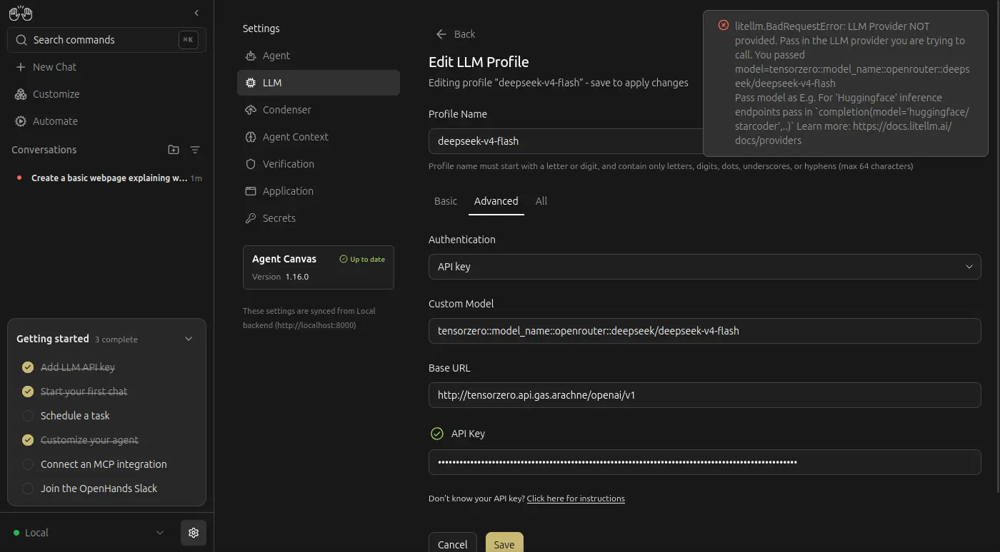

設定模型時需要加入一個 `openai/` 的前綽，似乎是 litellm SDK 的問題：

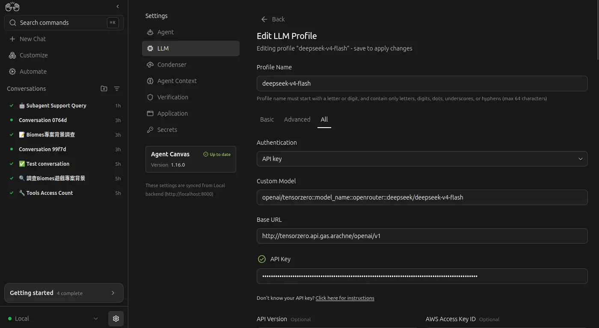

### 多 Agent 隔離

我原本想說既然 OpenHands 都有意識到要處理「隔離」的問題，對於這種 client-server 架構的 SaaS 模式，處理多租戶或 Agent 之間的隔離應該是基本功能吧？

不過很遺憾的，並沒有，一個 Agent 能夠訪問其他 Workspace，甚至能訪問運行著 OpenHands 本身的系統目錄：

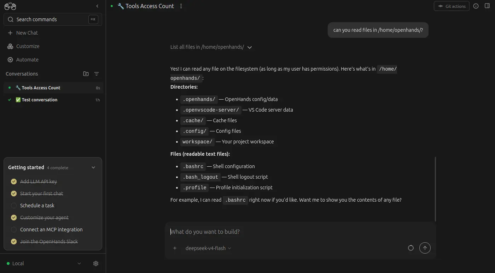

### Backend

在 OpenHands 的設計中存在著名為 "Backend" 的概念：

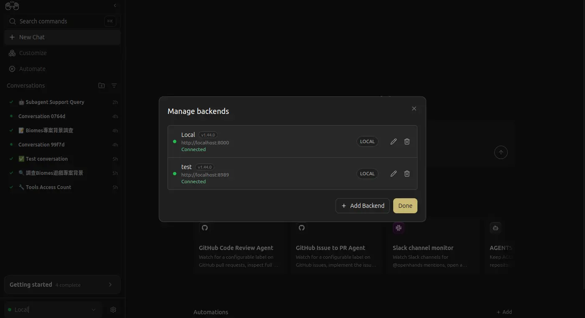

我原本以為是 server-worker 架構，如果我開另外一個容器作為 Backend 是不是就能隔離不同的 Agent 了？

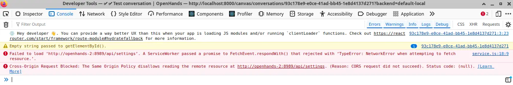

否，瀏覽器的前端是直通 "Backend" 的，所有 LLM Provider 之類的配置要重新設定。

所以一個 "Backend" 其實只是普通、可以訪問所有檔案系統的無頭 Agent，然後運行在 Docker 內就碰巧"沙盒化"了，它甚至不能和其他的 Agent 工具（例如 Crush）搭配使用。
