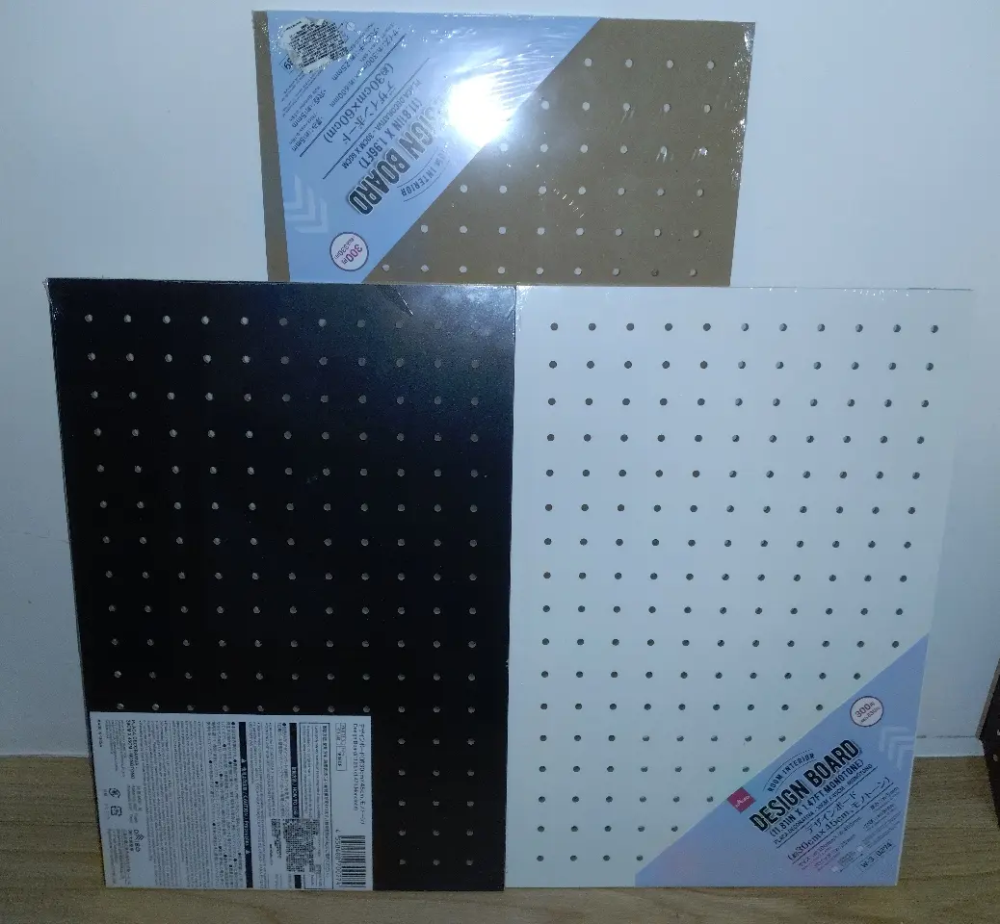
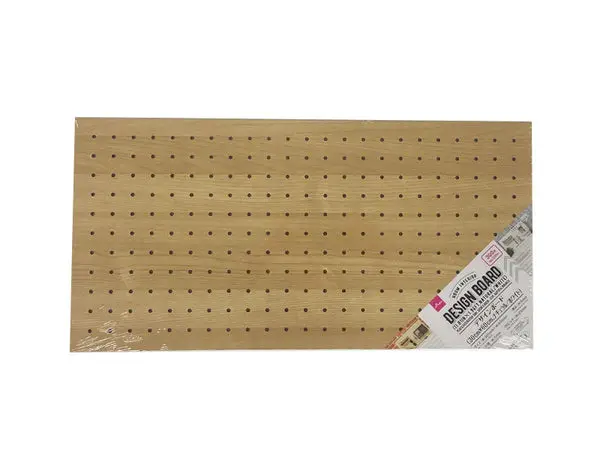
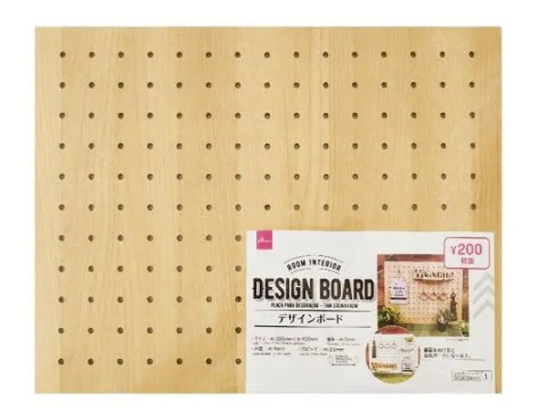

# 大創洞洞板

<head>
  <meta property="og:image" content="https://raw.githubusercontent.com/FlySkyPie/flyskypie.github.io/main/post/2026-10-04_daiso-design-board/00_board.webp" />
</head>

眾所皆知，我是大創洞洞板的重度用戶（？），最近去大創買洞洞板發現出了新的系列：

分別是 ３０ｃｍ×４５ｃｍ 的 [4550480700274](https://jp.daisonet.com/products/4550480700274) 和 ３０ｃｍ×６０ｃｍ 的 [4550480693989](https://jp.daisonet.com/products/4550480693989)。

首先是 4550480693989，跟前一代 ３０ｃｍ×６０ｃｍ 產品 (4549131964318) 的差別是少了表面塗裝，變成單純的有洞密集板。

4550480700274 和前一代 4549131732429 產品的差一則是長度從 40 公分改成 45 公分。

少了塗層的版本雖然視覺更乾淨但是降低了魯棒性，另外一方面我的層架系統是 45 公分深的，40 公分的版本幾乎不用修改就可以放進去使用，45 公分的版本會造成一定程度上的影響。

根據我的體驗(R30 與 R35 系列收納箱)，大創不少產品都是有時效性的，週期過了就不會再生產了，兩個改變對我都有點影響，於是筆記一下。
