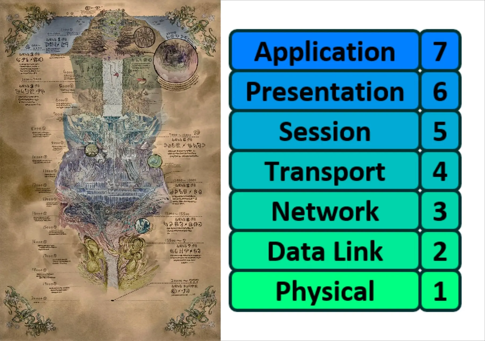
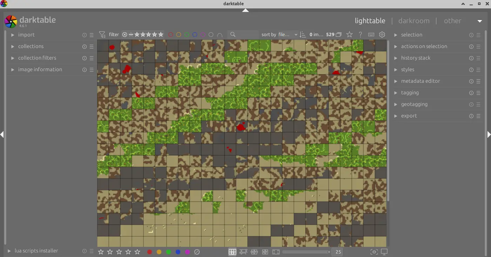

# 從 Bug 開始的 C++ 之旅：Katabasis

<head>
  <meta property="og:image" content="https://raw.githubusercontent.com/FlySkyPie/flyskypie.github.io/main/post/2026-10-10_project-katabasis/05_tiles.webp" />
</head>


~~沒錯，作者又挖新坑了~~

## 前因

這個專案因為把很多前提混在一起執行，所以因果關係解釋起來有點複雜。

### Minecraft AI 計畫

眾所皆知，我想在 Minecraft 內搞 AI（？）

有兩種實現路徑：

- 自行實現「類 Minecraft」
- 使用現成的 Minecraft

個人是偏好前者，因為我預期的訓練環境跟 Minecraft 原生的遊戲設計有諸多不同之處，與其硬著頭皮修改不如直接做一個不一樣的實做。然而這條路線的進度緩慢，重建 Biomes 的研究越是了解它，就越舉步難行。

因此最近考慮試著走第二條路徑，雖然它對我而言比較像是抄捷徑。

### 特修斯的 Minecraft

一個標準的 Minecraft 配置需要有兩個東西：

- Minecraft Client
- Minecraft Server

兩者都是 Mojang （現在是 Microsoft） 持有智慧財產權的產品，並且透過 Minecraft 的協定連線。

架設伺服器方面，為了用更少的資源提供更多的服務，並且並沒有渲染相關的需求，因此有強烈的動機被使用 Java 以外的語言重新實做，諸如：[Cuberite (C++)](https://github.com/cuberite/cuberite)、[Valence (Rust)](https://github.com/valence-rs/valence)、[bareiron (C)](https://github.com/p2r3/bareiron)...。

另外也有像 [Mineflayer (Javscript)](https://github.com/prismarinejs/mineflayer) 或 [Botcraft (C++)](https://github.com/adepierre/Botcraft) 這樣為了製作機器人而存在的函式庫可作為 Minecraft Client 端運作，[stevenarella (Rust)](https://github.com/iceiix/stevenarella) 或 [Leafish (Rust)](https://github.com/Lea-fish/Leafish) 這類專案則是試圖打造具有渲染能力的 Client 端。

因此倘若我們將任意一個開源的 Client 端和 Server 端做組合，Mojang 創造的程式碼實作就會完全消失，只留下 Minecraft 協定在兩個程式之間通訊。

這就是特修斯的 Minecraft。

### "韌體"工程師

最近找到新工作，但是我的感覺像是：


但是我寫的C++就像智障一樣，因此我急需找到一個足夠引我入勝的題目來練習 C++。

### 在 RPG 系統玩 RTS


這些日系輕小說（漫畫）的的轉生者（穿越者）們實際上是在 RPG (Role-Playing Game) 系統的世界中玩著 RTS (Real-time Strategy)：

- ヘルモード　～やり込み好きのゲーマーは廃設定の異世界で無双する～
- 黄金の経験値
- 異世界黙示録マイノグーラ～破滅の文明で始める世界征服～
- 女王陛下の異世界戦略

看著看著就會冒出一股想征服世界的欲望（？）


### 行為樹

在先前的文章我應該不只一次表示我苟同目前主流的 ReAct 模式，而應該使用行為樹這類經過時間考驗的技術，因此我最近陸陸續續有做一些行為樹相關的小專案。

## Katabasis

Katabasis 出自古希臘語，有「冥界之旅」的意思，並且特修斯在神話中也去過冥界。



看過在「來自深淵」人想必對「上升負荷」與「絕界行」的概念並不陌生，有趣的是以 OSI 網路模型來說，每下降一層工程師都會面臨一定程度的認知負荷，因為在前一層存在的前提條件在這裡可能不存在。

> PCIe 上插的東西不是固定的；
> 
> IP 不是固定的；
> 
> MAC 不是固定的；
> 
> BIOS 也不是固定的，
> 
> 還有什麼東西不是固定的？普朗克常數嗎？
> 

這是我這個前端 Web 仔經歷了三個月的體驗之後的感想。

所以這個什麼 Katabasis 專案到底要做些什麼？簡單來說：

> 用 C++ 實做的 Minecraft 伺服器與 C++ 實做的 Minecraft 客戶端加上用 C++ 實做的行為樹建構的智能體來征服 Minecraft 的大地，順利的話可以再打個幾場總體戰。

## 從 Bug 開始的 C++ 之旅

當我興致高昂的把 Cuberite 和 Botcraft 組裝在一起的時候，現實立刻潑了我冷水：

```
terminate called after throwing an instance of 'std::runtime_error'
  what():  While reading z_dist (7th field) in ClientboundLevelParticlesPacket
Not enough input in ReadData
[2026-08-28 15:00:04.714] [ FATAL ] [NetworkPacketProcessing - BCHelloWorld(129371737433792)] NetworkManager.cpp(399): Parsing exception while parsing message "Level Particles"
While reading z_dist (7th field) in ClientboundLevelParticlesPacket
Not enough input in ReadData
[2026-08-28 15:00:04.714] [ FATAL ] [NetworkPacketProcessing - BCHelloWorld(129371737433792)] NetworkManager.cpp(367): Exception:
While reading z_dist (7th field) in ClientboundLevelParticlesPacket
Not enough input in ReadData
```

於是我用 Dockerfile 弄了一個再現交給了 Botcraft 的原作者：

https://github.com/FlySkyPie/20260828_Cuberite-Botcraft_reproduce

即便該問題很快的就在九月初 (2026) 被修復了，然而我沒有很快的投入 Botcraft 開發的主要原因有二：

- 無頭模式的伺服器難以觀察 Bot 在遊戲中的活動
- 缺乏行為樹的理解與設計範式

## 行為樹領域知識

行為樹和 ECS (Entity-Component-System) 一樣，都是屬於特定領域的軟體工程範式，有一定的學習曲線以及領域模型要面對，為此我做了一些準備：

- 翻譯一個看起來很有參考性的網站 ([www.behaviortrees.com](https://www.behaviortrees.com/))，【[Live Demo](https://flyskypie.github.io/behaviortrees-docs/)】【[Source](https://github.com/FlySkyPie/behaviortrees-docs)】
- 用 Agent 從網路上掃一些東西並整貍成[調查報告](https://github.com/FlySkyPie/Mind-Palace/blob/017ce8bcd1b23c147b07956413c7402c001e9f7f/agent-zone/researches/006_behavior-tree/00088_behavior-tree-domain-knowledge-zh.md)，【[其他報告](https://github.com/FlySkyPie/Mind-Palace/tree/017ce8bcd1b23c147b07956413c7402c001e9f7f/agent-zone/researches/006_behavior-tree)】

## 可觀測性

最直覺的方式就是讓伺服器端生成 Web GIS (Geographic Information System)，Minecraft 的生態系已經存在 [BlueMap](https://github.com/BlueMap-Minecraft/BlueMap)、[dynmap](https://github.com/webbukkit/dynmap)、[squaremap](https://github.com/jpenilla/squaremap) 和 [Pl3xMap](https://github.com/granny/Pl3xMap)，不過很遺憾，這些方案都無法直接在 Cuberite 使用。

唯一一個有一點參考性的野雞專案：

https://github.com/KrystilizeNevaDies/StaticMap

實現方式相當土法：

- 將圖磚資料寫入 `.ppm` 檔案
- 呼叫 Magick 的執行檔將其轉換成圖片

原因是 Cuberite 的插件系統使用 Lua，但是在 Lua 的空間內並沒有圖像處理函式庫。

我計畫簡化這方面的實作，單純作為提供[地圖圖磚](https://en.wikipedia.org/wiki/Tiled_web_map)的 HTTP 伺服器，瀏覽器端的實作就交給 Grafana 的 Geomap 處理。

為了達成這一點，我計畫在 Lua 空間再呼叫由 C++ 實做的 Native Binding，如此一來便能在 C++ 的上下文中引入諸如處理 PNG 、SQLite 或 HTTP 的函式庫。

目前並沒有太多的進展：

- 從 Lua 監聽 Cuberite 提供的 hook
- 呼叫 C++ 實做的 ABI (Application binary interface)
- 自 C++ 的實作中解開遊戲地圖的資料、渲染成鳥瞰圖並且儲存到檔案系統。



目前因為把水跟樹葉設定成透明，因此只會讓像素變暗而不是呈現樹葉的綠色或海水的藍色。
